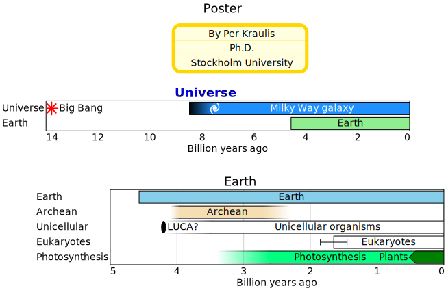
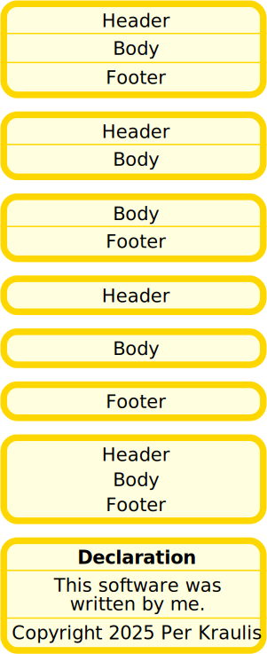

# board

- [Examples](#examples)
  - [poster](#poster)
  - [notes](#notes)

- [Specification](#specification)

## Examples

### poster



```yaml
chysl:
  version: 0.2.8
  software: Chysl (Python) 0.2.8
chart: board
title: Poster
entries:
- x: 250
  y: 10
  scale: 1
  component:
    chart: note
    title: By Per Kraulis
    body: Ph.D.
    footer: Stockholm University
- x: 0
  y: 100
  scale: 1
  component:
    include: universe.yaml
- x: 50
  y: 230
  scale: 1
  component:
    include: earth.yaml
```
### notes



```yaml
chysl:
  version: 0.2.8
  software: Chysl (Python) 0.2.8
chart: board
entries:
- x: 0
  y: 0
  scale: 1.5
  component:
    chart: column
    entries:
    - chart: note
      title: Header
      body: Body
      footer: Footer
    - chart: note
      title: Header
      body: Body
    - chart: note
      body: Body
      footer: Footer
    - chart: note
      title: Header
    - chart: note
      body: Body
    - chart: note
      footer: Footer
    - chart: note
      title: Header
      body: Body
      footer: Footer
      line: 0
    - include: declaration.yaml
```
## Specification

[JSON Schema](board.md)

Chart to place charts at specified positions.

- **chart**:
  - *required*
  - *const* 'board'
- **title**: Title of the board.
  - *See* [text](schema_defs.md#text).
- **entries**: Component charts at specified positions.
  - *required*
  - *type*: sequence
  - *items*:
    - *type*: mapping
    - **x**: Absolute position of component. Left is 0.
      - *required*
      - *type*: float
      - *minimum*: 0
    - **y**: Absolute position of component. Top is 0.
      - *required*
      - *type*: float
      - *minimum*: 0
    - **scale**: Scaling of the component chart.
      - *type*: float
      - *exclusiveMinimum*: 0
      - *default*: 1
    - **component**:
      - *See* [chart_or_include](schema_defs.md#chart_or_include).
      - *required*

