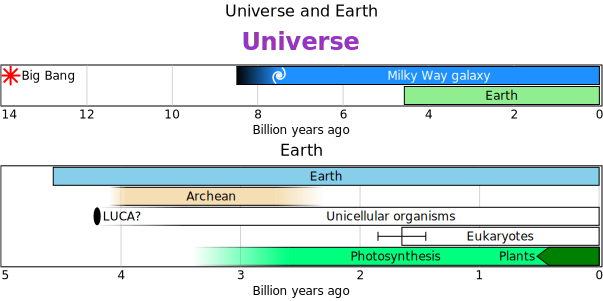

# column

- [Examples](#examples)
- [Specification](#specification)
  - [universe_earth](#universe_earth)
  - [cpies](#cpies)
  - [cnotes](#cnotes)
  - [notes](#notes)

## Examples

### universe_earth



```yaml
chysl:
  version: 0.1.0
  software: Chysl (Python) 0.1.0
  timestamp: '2025-05-20T06:45:53+00:00'
chart: column
title: Universe and Earth
entries:
- chart: timelines
  title:
    text: Universe
    bold: true
    color: blue
  entries:
  - entry: event
    label: Big Bang
    timeline: Universe
    color: red
    instant: -13787000000
    marker: star
  - entry: period
    label: Milky Way galaxy
    timeline: Universe
    color: navy
    begin:
      value: -7500000000
      low: -8500000000
    end: 0
    fuzzy: gradient
  - entry: period
    label: Earth
    color: lightgreen
    begin: -4567000000
    end: 0
  - entry: event
    label: Block
    timeline: markers
    instant:
      value: -12000000000
      error: 600000000
    marker: block
    placement: left
  - entry: event
    label: Circle
    timeline: markers
    color: cyan
    instant: -10000000000
    marker: circle
    placement: center
  - entry: event
    label: Ellipse
    timeline: markers
    color: blue
    instant: -8000000000
    marker: ellipse
    placement: left
  - entry: event
    label: Oval
    timeline: markers
    color: orange
    instant:
      value: -6200000000
      low: -6500000000
      high: -5500000000
    placement: left
  - entry: event
    label: Pyramid
    timeline: markers
    color: gold
    instant: -4000000000
    marker: pyramid
    placement: center
  - entry: event
    label: Triangle
    timeline: markers
    color: purple
    instant: -2000000000
    marker: triangle
  legend: false
  axis:
    absolute: true
    caption: Billion years ago
- chart: timelines
  title: Earth
  entries:
  - entry: period
    label: Earth
    begin: -4567000000
    end: 0
  - entry: period
    label: Archean
    color: wheat
    begin:
      value: -4000000000
      low: -4100000000
      high: -3950000000
    end:
      value: -2500000000
      error: 200000000
    fuzzy: gradient
  - entry: event
    label: LUCA?
    timeline: Unicellular
    instant: -4200000000
  - entry: period
    label: Unicellular organisms
    timeline: Unicellular
    begin:
      value: -3480000000
      low: -4200000000
    end: 0
    fuzzy: gradient
  - entry: period
    label: Eukaryotes
    begin: -1650000000
    end: 0
  - entry: period
    label: Engineers
    color: lightgray
    begin:
      value: -3300000000
      error: 200000000
    end: -1650000000
    fuzzy: wedge
  - entry: period
    label: Photosynthesis
    color: springgreen
    begin: -3400000000
    end: 0
  - entry: period
    label: Plants
    timeline: Photosynthesis
    color: green
    begin: -470000000
    end: 0
    placement: left
  legend: false
  axis:
    absolute: true
    caption: Billion years ago
```
### cpies


```yaml
chysl:
  version: 0.1.0
  software: Chysl (Python) 0.1.0
  timestamp: '2025-05-20T06:45:53+00:00'
chart: column
title: Pies in column
entries:
- chart: piechart
  title: Strawberry pie
  entries:
  - entry: slice
    label: Flour
    value: 7
    color: white
  - entry: slice
    label: Eggs
    value: 2
    color: yellow
  - entry: slice
    label: Butter
    value: 3
    color: gold
  - entry: slice
    label: Strawberries
    value: 3
    color: orangered
  diameter: 100
- chart: piechart
  title: Rhubarb pie
  entries:
  - entry: slice
    label: Flour
    value: 7
    color: white
  - entry: slice
    label: Eggs
    value: 2
    color: yellow
  - entry: slice
    label: Butter
    value: 3
    color: gold
  - entry: slice
    label: Rhubarb
    value: 3
    color: green
- chart: note
  title: Comment
  body: Strawberry pie is good.
  footer:
    text: Copyright 2025 Per Kraulis
    italic: true
```
### cnotes


```yaml
chysl:
  version: 0.1.0
  software: Chysl (Python) 0.1.0
  timestamp: '2025-05-20T06:45:53+00:00'
chart: column
entries:
- chart: note
  title: Header
  body: Body
  footer: Footer
- chart: note
  title: Header
  body: Body
- chart: note
  body: Body
  footer: Footer
- chart: note
  title: Header
- chart: note
  body: Body
- chart: note
  footer: Footer
- chart: note
  title: Header
  body: Body
  footer: Footer
  line: 0
- include: declaration.yaml
```
### notes


```yaml
chysl:
  version: 0.1.0
  software: Chysl (Python) 0.1.0
  timestamp: '2025-05-20T06:45:53+00:00'
chart: board
entries:
- x: 0
  y: 0
  scale: 1.5
  component:
    chart: column
    entries:
    - chart: note
      title: Header
      body: Body
      footer: Footer
    - chart: note
      title: Header
      body: Body
    - chart: note
      body: Body
      footer: Footer
    - chart: note
      title: Header
    - chart: note
      body: Body
    - chart: note
      footer: Footer
    - chart: note
      title: Header
      body: Body
      footer: Footer
      line: 0
    - include: declaration.yaml
```
## Specification

[JSON Schema](column.md)

Charts stacked in a column.

- **chart**:
  - *required*
- **title**: Title of the column chart.
    - *definition*: See [here](timelines.md)
- **align**: Align charts horizontally within the column.
  - *one of*: 'left', 'center', 'right'
  - *default*: 'center'
- **entries**: Component charts in the column.
  - *required*
  - *type*: sequence
  - *items*:
    - Alternative 1: Include another YAML file from the URI reference.
      - *type*: mapping
      - **include**:
        - *required*
        - *type*: string
        - *format*: uri-reference
    - Alternative 2: Specification of any chart.
      - *type*: mapping
      - **chart**:
        - *required*
        - *one of*: 'timelines', 'piechart', 'note', 'column', 'row', 'board'

