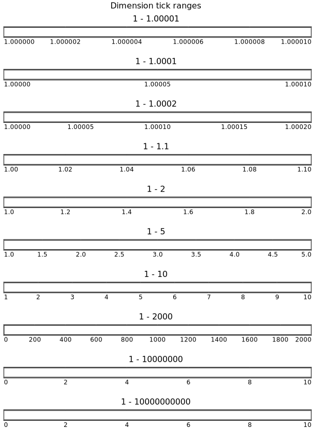

# column

- [Examples](#examples)
  - [universe_earth](#universe_earth)
  - [pies_column](#pies_column)
  - [notes_column](#notes_column)
  - [notes](#notes)
  - [markers](#markers)
  - [dimensions](#dimensions)
  - [scatter_iris](#scatter_iris)

- [Specification](#specification)

## Examples

### universe_earth


```yaml
chysl: 0.5.1
chart: column
title: Universe and Earth
subcharts:
- chart: timelines
  title:
    size: 24
    bold: true
    color: darkorchid
    text: Universe
  entries:
  - label: Big Bang
    timeline: Universe
    color: red
    instant: -13787000000
    marker: burst
  - label: Milky Way galaxy
    timeline: Universe
    color: dodgerblue
    begin:
      value: -7500000000
      low: -8500000000
    end: 0
    fuzzy: gradient
    href: https://en.wikipedia.org/wiki/Milky_Way
  - timeline: Universe
    color: white
    instant: -7500000000
    marker: galaxy
    href: https://en.wikipedia.org/wiki/Milky_Way
  - label: Earth
    color: lightgreen
    begin: -4567000000
    end: 0
  legend: false
  axis:
    max: 50000000
    absolute: true
    caption: Billion years ago
- chart: timelines
  title: Earth
  entries:
  - label: Earth
    color: skyblue
    begin: -4567000000
    end: 0
  - label: Archean
    color: wheat
    begin:
      value: -4000000000
      low: -4100000000
      high: -3950000000
    end:
      value: -2500000000
      error: 200000000
    fuzzy: gradient
  - label: LUCA?
    timeline: Unicellular
    instant: -4200000000
  - label: Unicellular organisms
    timeline: Unicellular
    begin:
      value: -3480000000
      low: -4200000000
    end: 0
    fuzzy: gradient
  - label: Eukaryotes
    begin:
      value: -1650000000
      error: 200000000
    end: 0
  - label: Photosynthesis
    color: springgreen
    begin:
      value: -3400000000
      high: -2600000000
    end: 0
    fuzzy: gradient
  - label: Plants
    timeline: Photosynthesis
    color: green
    begin:
      value: -470000000
      error: 50000000
    end: 0
    placement: left
    fuzzy: wedge
  legend: false
  axis:
    max: 20000000
    absolute: true
    caption: Billion years ago
```
### pies_column


```yaml
chysl: 0.5.1
chart: column
title: Pies in column
subcharts:
- chart: piechart
  title: Strawberry pie
  slices:
  - value: 7
    label: Flour
    color: white
  - value: 2
    label: Eggs
    color: yellow
  - value: 3
    label: Butter
    color: gold
  - value: 3
    label: Strawberries
    color: orangered
    href: https://en.wikipedia.org/wiki/Strawberry
- chart: piechart
  title: Rhubarb pie
  diameter: 250
  slices:
  - value: 7
    label: Flour
    color: white
  - value: 2
    label: Eggs
    color: yellow
  - value: 3
    label: Butter
    color: gold
  - value: 3
    label: Rhubarb
    color: green
    href: https://en.wikipedia.org/wiki/Rhubarb
- chart: note
  title: Comment
  body: Strawberry pie is good.
  footer:
    italic: true
    text: Copyright 2025 Per Kraulis
padding: 10
```
### notes_column


```yaml
chysl: 0.5.1
chart: column
title: Notes in a column
subcharts:
- chart: note
  title: Header
  body: Body
  footer: Footer
- chart: note
  title: Header
  body: Body
- chart: note
  body: Body
  footer: Footer
- chart: note
  title: Header
- chart: note
  body: Body
  width: 200
- chart: note
  footer: Footer
  width: 200
- chart: note
  title: Header
  body: Body (no lines)
  footer: Footer
  line: 0
  width: 200
- include: declaration.yaml
padding: 4
```
### notes


```yaml
chysl: 0.5.1
chart: board
items:
- x: 0
  y: 0
  subchart:
    chart: column
    title: Notes in a column
    subcharts:
    - chart: note
      title: Header
      body: Body
      footer: Footer
    - chart: note
      title: Header
      body: Body
    - chart: note
      body: Body
      footer: Footer
    - chart: note
      title: Header
    - chart: note
      body: Body
      width: 200
    - chart: note
      footer: Footer
      width: 200
    - chart: note
      title: Header
      body: Body (no lines)
      footer: Footer
      line: 0
      width: 200
    - include: declaration.yaml
    padding: 4
  scale: 1.5
```
### markers


```yaml
chysl: 0.5.1
chart: column
subcharts:
- chart: scatter2d
  title: Geometry markers
  width: 400
  height: 225
  xaxis:
    max: 3.0
    labels: false
  yaxis: false
  xgrid: false
  ygrid: false
  points:
  - x: 0.2
    y: 1
    marker: disc
    color: gray
    label: disc
  - x: 1.2
    y: 1
    marker: circle
    color: coral
    label: circle
  - x: 2.2
    y: 1
    marker: oval
    color: dodgerblue
    label: oval
  - x: 0.2
    y: 2
    marker: oval-vertical
    color: orange
    label: oval-vertical
  - x: 1.2
    y: 2
    marker: oval-horizontal
    color: lime
    label: oval-horizontal
  - x: 2.2
    y: 2
    marker: ellipse
    color: gray
    label: ellipse
  - x: 0.2
    y: 3
    marker: ellipse-vertical
    color: coral
    label: ellipse-vertical
  - x: 1.2
    y: 3
    marker: ellipse-horizontal
    color: dodgerblue
    label: ellipse-horizontal
  - x: 2.2
    y: 3
    marker: block
    color: orange
    label: block
  - x: 0.2
    y: 4
    marker: square
    color: lime
    label: square
  - x: 1.2
    y: 4
    marker: square-cross
    color: gray
    label: square-cross
  - x: 2.2
    y: 4
    marker: diamond
    color: coral
    label: diamond
  - x: 0.2
    y: 5
    marker: diamond-cross
    color: dodgerblue
    label: diamond-cross
  - x: 1.2
    y: 5
    marker: diamond-fill
    color: orange
    label: diamond-fill
  - x: 2.2
    y: 5
    marker: pyramid
    color: lime
    label: pyramid
  - x: 0.2
    y: 6
    marker: triangle
    color: gray
    label: triangle
  - x: 1.2
    y: 6
    marker: wedge
    color: coral
    label: wedge
  - x: 2.2
    y: 6
    marker: trigon
    color: dodgerblue
    label: trigon
  - x: 0.2
    y: 7
    marker: pentagon
    color: orange
    label: pentagon
  - x: 1.2
    y: 7
    marker: pentagon-fill
    color: lime
    label: pentagon-fill
  - x: 2.2
    y: 7
    marker: hexagon
    color: gray
    label: hexagon
  - x: 0.2
    y: 8
    marker: hexagon-fill
    color: coral
    label: hexagon-fill
  - x: 1.2
    y: 8
    marker: heptagon
    color: dodgerblue
    label: heptagon
  - x: 2.2
    y: 8
    marker: heptagon-fill
    color: orange
    label: heptagon-fill
  - x: 0.2
    y: 9
    marker: octagon
    color: lime
    label: octagon
  - x: 1.2
    y: 9
    marker: octagon-fill
    color: gray
    label: octagon-fill
- chart: scatter2d
  title: Symbol markers
  width: 400
  height: 75
  xaxis:
    max: 3.0
    labels: false
  yaxis: false
  xgrid: false
  ygrid: false
  points:
  - x: 0.2
    y: 1
    marker: cross
    color: coral
    label: cross
  - x: 1.2
    y: 1
    marker: plus
    color: dodgerblue
    label: plus
  - x: 2.2
    y: 1
    marker: minus
    color: orange
    label: minus
  - x: 0.2
    y: 2
    marker: bar
    color: lime
    label: bar
  - x: 1.2
    y: 2
    marker: check
    color: gray
    label: check
  - x: 2.2
    y: 2
    marker: burst
    color: coral
    label: burst
  - x: 0.2
    y: 3
    marker: infinity
    color: dodgerblue
    label: infinity
  - x: 1.2
    y: 3
    marker: none
    color: orange
    label: none
- chart: scatter2d
  title: Astronomy markers
  width: 400
  height: 125
  xaxis:
    max: 3.0
    labels: false
  yaxis: false
  xgrid: false
  ygrid: false
  points:
  - x: 0.2
    y: 1
    marker: star
    color: lime
    label: star
  - x: 1.2
    y: 1
    marker: star-fill
    color: gray
    label: star-fill
  - x: 2.2
    y: 1
    marker: galaxy
    color: coral
    label: galaxy
  - x: 0.2
    y: 2
    marker: sun
    color: dodgerblue
    label: sun
  - x: 1.2
    y: 2
    marker: mercury
    color: orange
    label: mercury
  - x: 2.2
    y: 2
    marker: venus
    color: lime
    label: venus
  - x: 0.2
    y: 3
    marker: earth
    color: gray
    label: earth
  - x: 1.2
    y: 3
    marker: moon
    color: coral
    label: moon
  - x: 2.2
    y: 3
    marker: mars
    color: dodgerblue
    label: mars
  - x: 0.2
    y: 4
    marker: jupiter
    color: orange
    label: jupiter
  - x: 1.2
    y: 4
    marker: saturn
    color: lime
    label: saturn
  - x: 2.2
    y: 4
    marker: uranus
    color: gray
    label: uranus
  - x: 0.2
    y: 5
    marker: neptune
    color: coral
    label: neptune
- chart: scatter2d
  title: Greek markers
  width: 400
  height: 225
  xaxis:
    max: 3.0
    labels: false
  yaxis: false
  xgrid: false
  ygrid: false
  points:
  - x: 0.2
    y: 1
    marker: alpha
    color: dodgerblue
    label: alpha
  - x: 1.2
    y: 1
    marker: beta
    color: orange
    label: beta
  - x: 2.2
    y: 1
    marker: gamma
    color: lime
    label: gamma
  - x: 0.2
    y: 2
    marker: delta
    color: gray
    label: delta
  - x: 1.2
    y: 2
    marker: epsilon
    color: coral
    label: epsilon
  - x: 2.2
    y: 2
    marker: zeta
    color: dodgerblue
    label: zeta
  - x: 0.2
    y: 3
    marker: eta
    color: orange
    label: eta
  - x: 1.2
    y: 3
    marker: theta
    color: lime
    label: theta
  - x: 2.2
    y: 3
    marker: iota
    color: gray
    label: iota
  - x: 0.2
    y: 4
    marker: kappa
    color: coral
    label: kappa
  - x: 1.2
    y: 4
    marker: lambda
    color: dodgerblue
    label: lambda
  - x: 2.2
    y: 4
    marker: mu
    color: orange
    label: mu
  - x: 0.2
    y: 5
    marker: nu
    color: lime
    label: nu
  - x: 1.2
    y: 5
    marker: xi
    color: gray
    label: xi
  - x: 2.2
    y: 5
    marker: omicron
    color: coral
    label: omicron
  - x: 0.2
    y: 6
    marker: pi
    color: dodgerblue
    label: pi
  - x: 1.2
    y: 6
    marker: rho
    color: orange
    label: rho
  - x: 2.2
    y: 6
    marker: sigma
    color: lime
    label: sigma
  - x: 0.2
    y: 7
    marker: sigma1
    color: gray
    label: sigma1
  - x: 1.2
    y: 7
    marker: sigma2
    color: coral
    label: sigma2
  - x: 2.2
    y: 7
    marker: tau
    color: dodgerblue
    label: tau
  - x: 0.2
    y: 8
    marker: upsilon
    color: orange
    label: upsilon
  - x: 1.2
    y: 8
    marker: phi
    color: lime
    label: phi
  - x: 2.2
    y: 8
    marker: chi
    color: gray
    label: chi
  - x: 0.2
    y: 9
    marker: psi
    color: coral
    label: psi
  - x: 1.2
    y: 9
    marker: omega
    color: dodgerblue
    label: omega
padding: 10
```
### dimensions



```yaml
chysl: 0.5.1
chart: column
title: Dimension tick ranges
subcharts:
- chart: timelines
  title: 1 - 1.00001
  entries:
  - begin: 1
    end: 1.00001
- chart: timelines
  title: 1 - 1.0001
  entries:
  - begin: 1
    end: 1.0001
- chart: timelines
  title: 1 - 1.0002
  entries:
  - begin: 1
    end: 1.0002
- chart: timelines
  title: 1 - 1.1
  entries:
  - begin: 1
    end: 1.1
- chart: timelines
  title: 1 - 2
  entries:
  - begin: 1
    end: 2
- chart: timelines
  title: 1 - 5
  entries:
  - begin: 1
    end: 5
- chart: timelines
  title: 1 - 10
  entries:
  - begin: 1
    end: 10
- chart: timelines
  title: 1 - 2000
  entries:
  - begin: 1
    end: 2000
- chart: timelines
  title: 1 - 10000000
  entries:
  - begin: 1
    end: 10000000
- chart: timelines
  title: 1 - 10000000000
  entries:
  - begin: 1
    end: 10000000000
padding: 20
```
### scatter_iris

[CSV data file](scatter_iris.csv)


```yaml
chysl: 0.5.1
chart: column
title:
  size: 30
  text: Iris flower measurements
subcharts:
- chart: row
  subcharts:
  - chart: column
    subcharts:
    - chart: scatter2d
      width: 300
      height: 300
      xaxis:
        labels: false
      yaxis:
        caption: Sepal length
      size: 6
      points:
        source: scatter_iris.csv
        map:
          x: sepal length
          y: sepal length
          color:
            field: class
            map:
              Iris-setosa: red
              Iris-versicolor: green
              Iris-virginica: blue
          marker:
            field: class
            map:
              Iris-setosa: circle
              Iris-versicolor: triangle
              Iris-virginica: square
    - chart: scatter2d
      width: 300
      height: 300
      xaxis:
        labels: false
      yaxis:
        caption: Sepal width
      size: 6
      points:
        source: scatter_iris.csv
        map:
          x: sepal length
          y: sepal width
          color:
            field: class
            map:
              Iris-setosa: red
              Iris-versicolor: green
              Iris-virginica: blue
          marker:
            field: class
            map:
              Iris-setosa: circle
              Iris-versicolor: triangle
              Iris-virginica: square
    - chart: scatter2d
      width: 300
      height: 300
      xaxis:
        labels: false
      yaxis:
        caption: Petal length
      size: 6
      points:
        source: scatter_iris.csv
        map:
          x: sepal length
          y: petal length
          color:
            field: class
            map:
              Iris-setosa: red
              Iris-versicolor: green
              Iris-virginica: blue
          marker:
            field: class
            map:
              Iris-setosa: circle
              Iris-versicolor: triangle
              Iris-virginica: square
    - chart: scatter2d
      width: 300
      height: 300
      xaxis:
        caption: Sepal length
      yaxis:
        caption: Petal width
      size: 6
      points:
        source: scatter_iris.csv
        map:
          x: sepal length
          y: petal width
          color:
            field: class
            map:
              Iris-setosa: red
              Iris-versicolor: green
              Iris-virginica: blue
          marker:
            field: class
            map:
              Iris-setosa: circle
              Iris-versicolor: triangle
              Iris-virginica: square
    align: right
    padding: 4
  - chart: column
    subcharts:
    - chart: scatter2d
      width: 300
      height: 300
      xaxis:
        labels: false
      yaxis:
        labels: false
      size: 6
      points:
        source: scatter_iris.csv
        map:
          x: sepal width
          y: sepal length
          color:
            field: class
            map:
              Iris-setosa: red
              Iris-versicolor: green
              Iris-virginica: blue
          marker:
            field: class
            map:
              Iris-setosa: circle
              Iris-versicolor: triangle
              Iris-virginica: square
    - chart: scatter2d
      width: 300
      height: 300
      xaxis:
        labels: false
      yaxis:
        labels: false
      size: 6
      points:
        source: scatter_iris.csv
        map:
          x: sepal width
          y: sepal width
          color:
            field: class
            map:
              Iris-setosa: red
              Iris-versicolor: green
              Iris-virginica: blue
          marker:
            field: class
            map:
              Iris-setosa: circle
              Iris-versicolor: triangle
              Iris-virginica: square
    - chart: scatter2d
      width: 300
      height: 300
      xaxis:
        labels: false
      yaxis:
        labels: false
      size: 6
      points:
        source: scatter_iris.csv
        map:
          x: sepal width
          y: petal length
          color:
            field: class
            map:
              Iris-setosa: red
              Iris-versicolor: green
              Iris-virginica: blue
          marker:
            field: class
            map:
              Iris-setosa: circle
              Iris-versicolor: triangle
              Iris-virginica: square
    - chart: scatter2d
      width: 300
      height: 300
      xaxis:
        caption: Sepal width
      yaxis:
        labels: false
      size: 6
      points:
        source: scatter_iris.csv
        map:
          x: sepal width
          y: petal width
          color:
            field: class
            map:
              Iris-setosa: red
              Iris-versicolor: green
              Iris-virginica: blue
          marker:
            field: class
            map:
              Iris-setosa: circle
              Iris-versicolor: triangle
              Iris-virginica: square
    align: right
    padding: 4
  - chart: column
    subcharts:
    - chart: scatter2d
      width: 300
      height: 300
      xaxis:
        labels: false
      yaxis:
        labels: false
      size: 6
      points:
        source: scatter_iris.csv
        map:
          x: petal length
          y: sepal length
          color:
            field: class
            map:
              Iris-setosa: red
              Iris-versicolor: green
              Iris-virginica: blue
          marker:
            field: class
            map:
              Iris-setosa: circle
              Iris-versicolor: triangle
              Iris-virginica: square
    - chart: scatter2d
      width: 300
      height: 300
      xaxis:
        labels: false
      yaxis:
        labels: false
      size: 6
      points:
        source: scatter_iris.csv
        map:
          x: petal length
          y: sepal width
          color:
            field: class
            map:
              Iris-setosa: red
              Iris-versicolor: green
              Iris-virginica: blue
          marker:
            field: class
            map:
              Iris-setosa: circle
              Iris-versicolor: triangle
              Iris-virginica: square
    - chart: scatter2d
      width: 300
      height: 300
      xaxis:
        labels: false
      yaxis:
        labels: false
      size: 6
      points:
        source: scatter_iris.csv
        map:
          x: petal length
          y: petal length
          color:
            field: class
            map:
              Iris-setosa: red
              Iris-versicolor: green
              Iris-virginica: blue
          marker:
            field: class
            map:
              Iris-setosa: circle
              Iris-versicolor: triangle
              Iris-virginica: square
    - chart: scatter2d
      width: 300
      height: 300
      xaxis:
        caption: Petal length
      yaxis:
        labels: false
      size: 6
      points:
        source: scatter_iris.csv
        map:
          x: petal length
          y: petal width
          color:
            field: class
            map:
              Iris-setosa: red
              Iris-versicolor: green
              Iris-virginica: blue
          marker:
            field: class
            map:
              Iris-setosa: circle
              Iris-versicolor: triangle
              Iris-virginica: square
    align: right
    padding: 4
  - chart: column
    subcharts:
    - chart: scatter2d
      width: 300
      height: 300
      xaxis:
        labels: false
      yaxis:
        labels: false
      size: 6
      points:
        source: scatter_iris.csv
        map:
          x: petal width
          y: sepal length
          color:
            field: class
            map:
              Iris-setosa: red
              Iris-versicolor: green
              Iris-virginica: blue
          marker:
            field: class
            map:
              Iris-setosa: circle
              Iris-versicolor: triangle
              Iris-virginica: square
    - chart: scatter2d
      width: 300
      height: 300
      xaxis:
        labels: false
      yaxis:
        labels: false
      size: 6
      points:
        source: scatter_iris.csv
        map:
          x: petal width
          y: sepal width
          color:
            field: class
            map:
              Iris-setosa: red
              Iris-versicolor: green
              Iris-virginica: blue
          marker:
            field: class
            map:
              Iris-setosa: circle
              Iris-versicolor: triangle
              Iris-virginica: square
    - chart: scatter2d
      width: 300
      height: 300
      xaxis:
        labels: false
      yaxis:
        labels: false
      size: 6
      points:
        source: scatter_iris.csv
        map:
          x: petal width
          y: petal length
          color:
            field: class
            map:
              Iris-setosa: red
              Iris-versicolor: green
              Iris-virginica: blue
          marker:
            field: class
            map:
              Iris-setosa: circle
              Iris-versicolor: triangle
              Iris-virginica: square
    - chart: scatter2d
      width: 300
      height: 300
      xaxis:
        caption: Petal width
      yaxis:
        labels: false
      size: 6
      points:
        source: scatter_iris.csv
        map:
          x: petal width
          y: petal width
          color:
            field: class
            map:
              Iris-setosa: red
              Iris-versicolor: green
              Iris-virginica: blue
          marker:
            field: class
            map:
              Iris-setosa: circle
              Iris-versicolor: triangle
              Iris-virginica: square
    align: right
    padding: 4
  padding: 4
- chart: column
  subcharts:
  - chart: note
    body:
      size: 24
      color: red
      text: 'Iris setosa: red circles'
    frame: false
    background: white
  - chart: note
    body:
      size: 24
      color: green
      text: 'Iris versicolor: green triangles'
    frame: false
    background: white
  - chart: note
    body:
      size: 24
      color: blue
      text: 'Iris virginica: blue squares'
    frame: false
    background: white
padding: 4
```
## Specification

[JSON Schema](column.md)

Charts stacked in a column.

- **chart**:
  - *required*
  - *const* 'column'
- **title**: Title of the chart.
  - *See* [text](schema_defs.md#text).
- **description**: Description of the chart. Rendered as <desc> in SVG.
  - *type*: string
- **align**: Align charts horizontally within the column.
  - *one of*: 'left', 'center', 'right'
  - *default*: 'center'
- **padding**: Padding between the subcharts.
  - *type*: float
  - *minimum*: 0
  - *default*: 0
- **subcharts**: Charts in the column.
  - *required*
  - *type*: sequence
  - *items*:
    - *See* [chart_or_include](schema_defs.md#chart_or_include).

