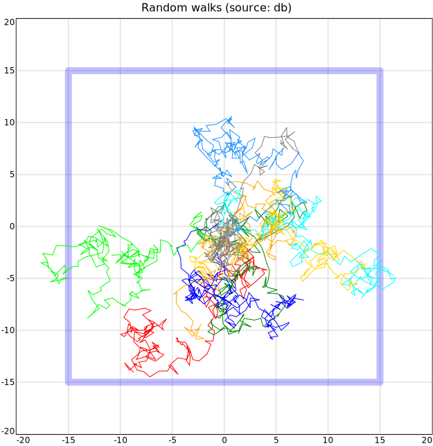

# lines2d

- [Examples](#examples)
  - [lines_random_walks](#lines_random_walks)

- [Specification](#specification)

## Examples

### lines_random_walks

[Sqlite database file](lines_random_walks.db)



```yaml
chysl: 0.3.6
chart: lines2d
title: 'Random walks (source: db)'
lines:
- linewidth: 10
  color: black
  opacity: 0.25
  href: https://en.wikipedia.org/wiki/Random_walk
  line:
  - x: -15
    y: -15
  - x: -15
    y: 15
  - x: 15
    y: 15
  - x: 15
    y: -15
  - x: -15
    y: -15
- color: red
  line:
    source:
      database: sqlite
      location: lines_random_walks.db
      select: SELECT x, y FROM walks WHERE run=1 ORDER BY i
- color: green
  line:
    source:
      database: sqlite
      location: lines_random_walks.db
      select: SELECT x, y FROM walks WHERE run=2 ORDER BY i
- color: blue
  line:
    source:
      database: sqlite
      location: lines_random_walks.db
      select: SELECT x, y FROM walks WHERE run=3 ORDER BY i
- color: lime
  line:
    source:
      database: sqlite
      location: lines_random_walks.db
      select: SELECT x, y FROM walks WHERE run=4 ORDER BY i
- color: orange
  line:
    source:
      database: sqlite
      location: lines_random_walks.db
      select: SELECT x, y FROM walks WHERE run=5 ORDER BY i
- color: cyan
  line:
    source:
      database: sqlite
      location: lines_random_walks.db
      select: SELECT x, y FROM walks WHERE run=6 ORDER BY i
- color: gold
  line:
    source:
      database: sqlite
      location: lines_random_walks.db
      select: SELECT x, y FROM walks WHERE run=7 ORDER BY i
- color: dodgerblue
  line:
    source:
      database: sqlite
      location: lines_random_walks.db
      select: SELECT x, y FROM walks WHERE run=8 ORDER BY i
- color: gray
  line:
    source:
      database: sqlite
      location: lines_random_walks.db
      select: SELECT x, y FROM walks WHERE run=9 ORDER BY i
```
## Specification

[JSON Schema](lines2d.md)

2D lines chart.

- **chart**:
  - *required*
  - *const* 'lines2d'
- **title**:
  - *See* [title](schema_defs.md#title).
- **description**:
  - *See* [description](schema_defs.md#description).
- **width**: Width of the chart, including legends etc.
  - *type*: float
  - *exclusiveMinimum*: 0
  - *default*: 600
- **xaxis**: X axis specification.
  - *See* [axis](schema_defs.md#axis).
- **yaxis**: Y axis specification.
  - *See* [axis](schema_defs.md#axis).
- **xgrid**: X grid specification.
  - *See* [grid](schema_defs.md#grid).
- **ygrid**: Y grid specification.
  - *See* [grid](schema_defs.md#grid).
- **lines**: An array of containers of 2D points to display as lines.
  - *required*
  - *type*: sequence
  - *items*:
    - *type*: mapping
    - **line**:
      - *See* [datapoints](schema_defs.md#datapoints).
      - *required*
    - **linewidth**: Width of the line.
      - *type*: float
      - *default*: 2
    - **color**: Color of the line.
      - *See* [color](schema_defs.md#color).
      - *default*: 'black'
    - **opacity**: Opacity of the line.
      - *See* [opacity](schema_defs.md#opacity).
    - **href**:
      - *See* [uri](schema_defs.md#uri).

