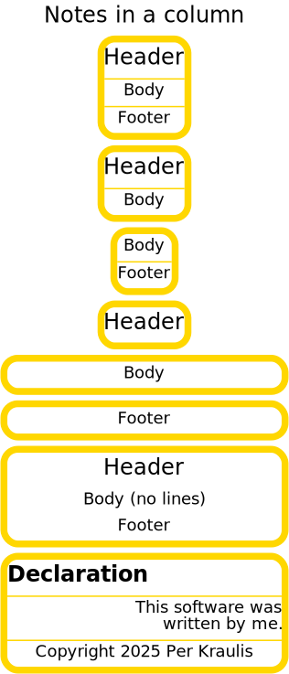

# note

- [Examples](#examples)
  - [declaration](#declaration)
  - [notes_column](#notes_column)
  - [notes](#notes)
  - [pies_column](#pies_column)
  - [poster](#poster)

- [Specification](#specification)

## Examples

### declaration


```yaml
chysl: 0.3.4
chart: note
title:
  text: Declaration
  bold: true
  placement: left
body:
  text: 'This software was

    written by me.'
  placement: right
footer:
  text: Copyright 2025 Per Kraulis
  italic: true
```
### notes_column


```yaml
chysl: 0.3.4
chart: column
subcharts:
- chart: note
  title: Header
  body: Body
  footer: Footer
- chart: note
  title: Header
  body: Body
- chart: note
  body: Body
  footer: Footer
- chart: note
  title: Header
- chart: note
  body: Body
- chart: note
  footer: Footer
- chart: note
  title: Header
  body: Body
  footer: Footer
  line: 0
- include: declaration.yaml
```
### notes



```yaml
chysl: 0.3.4
chart: board
subcharts:
- x: 0
  y: 0
  scale: 1.5
  subchart:
    chart: column
    subcharts:
    - chart: note
      title: Header
      body: Body
      footer: Footer
    - chart: note
      title: Header
      body: Body
    - chart: note
      body: Body
      footer: Footer
    - chart: note
      title: Header
    - chart: note
      body: Body
    - chart: note
      footer: Footer
    - chart: note
      title: Header
      body: Body
      footer: Footer
      line: 0
    - include: declaration.yaml
```
### pies_column


```yaml
chysl: 0.3.4
chart: column
title: Pies in column
subcharts:
- chart: piechart
  title: Strawberry pie
  slices:
  - value: 7
    label: Flour
    color: white
  - value: 2
    label: Eggs
    color: yellow
  - value: 3
    label: Butter
    color: gold
  - value: 3
    label: Strawberries
    color: orangered
    href: https://en.wikipedia.org/wiki/Strawberry
- chart: piechart
  title: Rhubarb pie
  diameter: 250
  slices:
  - value: 7
    label: Flour
    color: white
  - value: 2
    label: Eggs
    color: yellow
  - value: 3
    label: Butter
    color: gold
  - value: 3
    label: Rhubarb
    color: green
    href: https://en.wikipedia.org/wiki/Rhubarb
- chart: note
  title: Comment
  body: Strawberry pie is good.
  footer:
    text: Copyright 2025 Per Kraulis
    italic: true
```
### poster


```yaml
chysl: 0.3.4
chart: board
title: Poster
subcharts:
- x: 250
  y: 10
  subchart:
    chart: note
    title: By Per Kraulis
    body: Ph.D.
    footer: Stockholm University
- x: 0
  y: 100
  subchart:
    include: universe.yaml
- x: 50
  y: 230
  subchart:
    include: earth.yaml
```
## Specification

[JSON Schema](note.md)

Textual note with title, body and footer text.

- **chart**:
  - *required*
  - *const* 'note'
- **title**: Title of the note.
  - *See* [text](schema_defs.md#text).
- **body**: Body of the note.
  - *See* [text](schema_defs.md#text).
- **footer**: Footer of the note.
  - *See* [text](schema_defs.md#text).
- **width**: Width of chart, in pixels.
  - *type*: float
  - *exclusiveMinimum*: 0
  - *default*: 200
- **frame**: Thickness of the frame.
  - *type*: float
  - *minimum*: 0
  - *default*: 5
- **color**: Color of the note frame and lines.
  - *type*: string
  - *format*: color
  - *default*: 'gold'
- **radius**: Radius of the frame edge curvature.
  - *type*: float
  - *minimum*: 0
  - *default*: 10
- **line**: Thickness of lines between sections.
  - *type*: float
  - *minimum*: 0
  - *default*: 1
- **background**: Background color of the note.
  - *type*: string
  - *format*: color
  - *default*: 'lightyellow'

