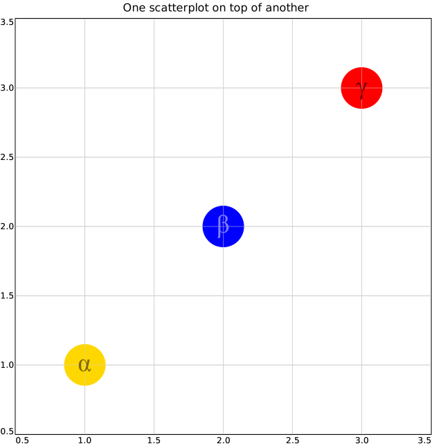

# overlay

- [Examples](#examples)
  - [points_marks](#points_marks)

- [Specification](#specification)

## Examples

### points_marks



```yaml
chysl: 0.4.0
chart: overlay
title: One scatterplot on top of another
layers:
- subchart:
    chart: scatter2d
    size: 60
    points:
    - x: 1
      y: 1
      color: gold
      href: https://en.wikipedia.org/wiki/Gold
    - x: 2
      y: 2
      color: blue
    - x: 3
      y: 3
      color: red
- opacity: 0.5
  subchart:
    chart: scatter2d
    size: 30
    points:
    - x: 1
      y: 1
      marker: alpha
    - x: 2
      y: 2
      color: white
      marker: beta
    - x: 3
      y: 3
      marker: gamma
```
## Specification

[JSON Schema](overlay.md)

Charts overlayed over one another, with optional opacity.

- **chart**:
  - *required*
  - *const* 'overlay'
- **title**: Title of the chart.
  - *See* [text](schema_defs.md#text).
- **description**: Description of the chart. Rendered as <desc> in SVG.
  - *type*: string
- **layers**: Charts to overlay, with optional opacity.
  - *required*
  - *type*: sequence
  - *items*:
    - *type*: mapping
    - **subchart**:
      - *See* [chart_or_include](schema_defs.md#chart_or_include).
      - *required*
    - **opacity**: Opacity of the subchart.
      - *type*: float
      - *minimum*: 0
      - *maximum*: 1
      - *default*: 1

