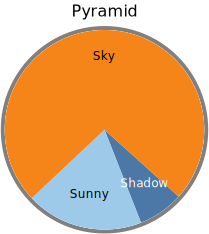

# piechart

- [Examples](#examples)
  - [pyramid](#pyramid)
  - [day](#day)
  - [pies_column](#pies_column)
  - [pies_row](#pies_row)

- [Specification](#specification)

## Examples

### pyramid



```yaml
chysl: 0.4.2
chart: piechart
title: Pyramid
frame:
  thickness: 4
  color: gray
start: 132
palette:
- '#4c78a8'
- '#9ecae9'
- '#f58518'
slices:
- x: 7
  label: Shadow
- x: 18
  label: Sunny
- x: 70
  label: Sky
```
### day


```yaml
chysl: 0.4.2
chart: piechart
title:
  size: 30
  text: Day
diameter: 400
total: 24
slices:
- x: 8
  label: Sleep
  color: gray
- x: 1
  label: Breakfast
  color: lightgreen
- x: 2
  label: Gym
  color: lightblue
- x: 1
  label: Read
  color: navy
- x: 1
  label: Lunch
  color: lightgreen
- x: 0.4
  label: Shuteye
  color: gray
- x: 4.6
  label: Write
  color: pink
- x: 1
  label: Dinner
  color: lightgreen
- x: 3
  label: TV
  color: orange
- x: 2
  label: Read
  color: navy
```
### pies_column


```yaml
chysl: 0.4.2
chart: column
title: Pies in column
subcharts:
- chart: piechart
  title: Strawberry pie
  slices:
  - x: 7
    label: Flour
    color: white
  - x: 2
    label: Eggs
    color: yellow
  - x: 3
    label: Butter
    color: gold
  - x: 3
    label: Strawberries
    color: orangered
    href: https://en.wikipedia.org/wiki/Strawberry
- chart: piechart
  title: Rhubarb pie
  diameter: 250
  slices:
  - x: 7
    label: Flour
    color: white
  - x: 2
    label: Eggs
    color: yellow
  - x: 3
    label: Butter
    color: gold
  - x: 3
    label: Rhubarb
    color: green
    href: https://en.wikipedia.org/wiki/Rhubarb
- chart: note
  title: Comment
  body: Strawberry pie is good.
  footer:
    italic: true
    text: Copyright 2025 Per Kraulis
padding: 10
```
### pies_row


```yaml
chysl: 0.4.2
chart: row
title: Pies in row
subcharts:
- chart: piechart
  title: Strawberry pie
  diameter: 300
  palette:
  - white
  - yellow
  - gold
  - red
  slices:
  - x: 7
    label: Flour
  - x: 2
    label: Eggs
  - x: 3
    label: Butter
  - x: 3
    label: Strawberries
    href: https://en.wikipedia.org/wiki/Strawberry
- chart: piechart
  title: Rhubarb pie
  palette:
  - white
  - yellow
  - gold
  - red
  slices:
  - x: 7
    label: Flour
  - x: 2
    label: Eggs
  - x: 3
    label: Butter
  - x: 3
    label: Rhubarb
    color: green
    href: https://en.wikipedia.org/wiki/Rhubarb
padding: 10
```
## Specification

[JSON Schema](piechart.md)

Pie chart displaying slices.

- **chart**:
  - *required*
  - *const* 'piechart'
- **title**: Title of the chart.
  - *See* [text](schema_defs.md#text).
- **description**: Description of the chart. Rendered as <desc> in SVG.
  - *type*: string
- **diameter**: Diameter of the pie chart.
  - *type*: float
  - *exclusiveMinimum*: 0
  - *default*: 200
- **frame**: Specification of the piechart perimeter.
  - *See* [frame](schema_defs.md#frame).
- **total**: Sum total x value to relate slice x values to.
  - *type*: float
  - *exclusiveMinimum*: 0
- **start**: Starting point for first slice; in degrees from the top.
  - *type*: float
- **palette**: Palette used for slices lacking explicit color specification.
  - *type*: sequence
  - *items*:
    - *type*: string
    - *format*: color
  - *default*: ['tomato', 'darkviolet', 'deeppink', 'deepskyblue', 'gold', 'yellowgreen']
- **slices**: Slices in the pie chart.
  - *required*
  - *type*: sequence
  - *items*:
    - *type*: mapping
    - **x**: The value visualized by the slice.
      - *required*
      - *type*: float
      - *exclusiveMinimum*: 0
    - **label**: Description of the x value.
      - *type*: string
    - **color**: Color of the slice. Overrides the palette.
      - *type*: string
      - *format*: color
    - **href**: A link URL, absolute or relative.
      - *type*: string
      - *format*: uri-reference

