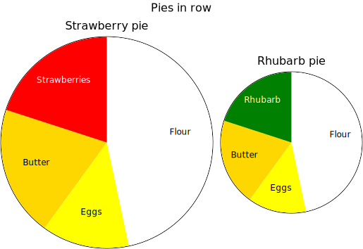

# piechart

- [Examples](#examples)
  - [pyramid](#pyramid)
  - [day](#day)
  - [pies_column](#pies_column)
  - [pies_row](#pies_row)

- [Specification](#specification)

## Examples

### pyramid


```yaml
chysl: 0.3.0
chart: piechart
title: Pyramid
entries:
- entry: slice
  value: 7
  label: Shadow
- entry: slice
  value: 18
  label: Sunny
- entry: slice
  value: 70
  label: Sky
start: 132
palette:
- '#4c78a8'
- '#9ecae9'
- '#f58518'
```
### day


```yaml
chysl: 0.3.0
chart: piechart
title:
  text: Day
  size: 30
entries:
- entry: slice
  value: 8
  label: Sleep
  color: gray
- entry: slice
  value: 1
  label: Breakfast
  color: lightgreen
- entry: slice
  value: 2
  label: Gym
  color: lightblue
- entry: slice
  value: 1
  label: Read
  color: navy
- entry: slice
  value: 1
  label: Lunch
  color: lightgreen
- entry: slice
  value: 0.4
  label: Shuteye
  color: gray
- entry: slice
  value: 4.6
  label: Write
  color: pink
- entry: slice
  value: 1
  label: Dinner
  color: lightgreen
- entry: slice
  value: 3
  label: TV
  color: orange
- entry: slice
  value: 2
  label: Read
  color: navy
diameter: 400
total: 24
```
### pies_column


```yaml
chysl: 0.3.0
chart: column
title: Pies in column
entries:
- chart: piechart
  title: Strawberry pie
  entries:
  - entry: slice
    value: 7
    label: Flour
    color: white
  - entry: slice
    value: 2
    label: Eggs
    color: yellow
  - entry: slice
    value: 3
    label: Butter
    color: gold
  - entry: slice
    value: 3
    label: Strawberries
    color: orangered
- chart: piechart
  title: Rhubarb pie
  entries:
  - entry: slice
    value: 7
    label: Flour
    color: white
  - entry: slice
    value: 2
    label: Eggs
    color: yellow
  - entry: slice
    value: 3
    label: Butter
    color: gold
  - entry: slice
    value: 3
    label: Rhubarb
    color: green
  diameter: 250
- chart: note
  title: Comment
  body: Strawberry pie is good.
  footer:
    text: Copyright 2025 Per Kraulis
    italic: true
```
### pies_row



```yaml
chysl: 0.3.0
chart: row
title: Pies in row
entries:
- chart: piechart
  title: Strawberry pie
  entries:
  - entry: slice
    value: 7
    label: Flour
  - entry: slice
    value: 2
    label: Eggs
  - entry: slice
    value: 3
    label: Butter
  - entry: slice
    value: 3
    label: Strawberries
  diameter: 300
  palette:
  - white
  - yellow
  - gold
  - red
- chart: piechart
  title: Rhubarb pie
  entries:
  - entry: slice
    value: 7
    label: Flour
  - entry: slice
    value: 2
    label: Eggs
  - entry: slice
    value: 3
    label: Butter
  - entry: slice
    value: 3
    label: Rhubarb
    color: green
  palette:
  - white
  - yellow
  - gold
  - red
```
## Specification

[JSON Schema](piechart.md)

Pie chart containing slices.

- **chart**:
  - *required*
  - *const* 'piechart'
- **title**: Title of the pie chart.
  - *See* [text](schema_defs.md#text).
- **diameter**: Diameter of the pie chart.
  - *type*: float
  - *exclusiveMinimum*: 0
  - *default*: 200
- **total**: Total value to relate slice values to.
  - *type*: float
  - *exclusiveMinimum*: 0
- **start**: Starting point for first slice; in degrees from the top.
  - *type*: float
- **palette**: Palette for slice colors.
  - *type*: sequence
  - *items*:
    - *type*: string
    - *format*: color
  - *default*: ['tomato', 'darkviolet', 'deeppink', 'deepskyblue', 'gold', 'yellowgreen']
- **entries**: Entries in the pie chart.
  - *required*
  - *type*: sequence
  - *items*:
    - Alternative 1: Slice in the pie chart.
      - *type*: mapping
      - **entry**:
        - *required*
        - *const* 'slice'
      - **value**: The value visualized by the slice.
        - *required*
        - *type*: float
        - *exclusiveMinimum*: 0
      - **label**: Description of the value.
        - *type*: string
      - **color**: Color of the slice. Palette used if not defined.
        - *type*: string
        - *format*: color

