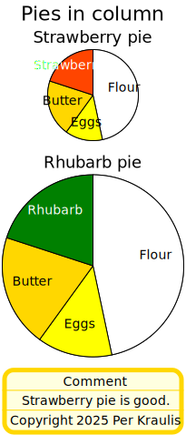

# piechart

- [Examples](#examples)
- [Specification](#specification)
  - [pyramid](#pyramid)
  - [day](#day)
  - [cpies](#cpies)
  - [rpies](#rpies)

## Examples

### pyramid


```yaml
chysl:
  version: 0.1.0
  software: Chysl (Python) 0.1.0
  timestamp: '2025-05-20T07:03:53+00:00'
chart: piechart
title: Pyramid
entries:
- entry: slice
  label: Shadow
  value: 7
- entry: slice
  label: Sunny
  value: 18
- entry: slice
  label: Sky
  value: 70
start: 132
palette:
- '#4c78a8'
- '#9ecae9'
- '#f58518'
```
### day


```yaml
chysl:
  version: 0.1.0
  software: Chysl (Python) 0.1.0
  timestamp: '2025-05-20T07:03:53+00:00'
chart: piechart
title:
  text: Day
  size: 30
entries:
- entry: slice
  label: Sleep
  value: 8
  color: gray
- entry: slice
  label: Breakfast
  value: 1
  color: lightgreen
- entry: slice
  label: Gym
  value: 2
  color: lightblue
- entry: slice
  label: Read
  value: 1
  color: navy
- entry: slice
  label: Lunch
  value: 1
  color: lightgreen
- entry: slice
  label: Shuteye
  value: 0.4
  color: gray
- entry: slice
  label: Write
  value: 4.6
  color: pink
- entry: slice
  label: Dinner
  value: 1
  color: lightgreen
- entry: slice
  label: TV
  value: 3
  color: orange
- entry: slice
  label: Read
  value: 2
  color: navy
diameter: 400
total: 24
```
### cpies



```yaml
chysl:
  version: 0.1.0
  software: Chysl (Python) 0.1.0
  timestamp: '2025-05-20T07:03:53+00:00'
chart: column
title: Pies in column
entries:
- chart: piechart
  title: Strawberry pie
  entries:
  - entry: slice
    label: Flour
    value: 7
    color: white
  - entry: slice
    label: Eggs
    value: 2
    color: yellow
  - entry: slice
    label: Butter
    value: 3
    color: gold
  - entry: slice
    label: Strawberries
    value: 3
    color: orangered
  diameter: 100
- chart: piechart
  title: Rhubarb pie
  entries:
  - entry: slice
    label: Flour
    value: 7
    color: white
  - entry: slice
    label: Eggs
    value: 2
    color: yellow
  - entry: slice
    label: Butter
    value: 3
    color: gold
  - entry: slice
    label: Rhubarb
    value: 3
    color: green
- chart: note
  title: Comment
  body: Strawberry pie is good.
  footer:
    text: Copyright 2025 Per Kraulis
    italic: true
```
### rpies


```yaml
chysl:
  version: 0.1.0
  software: Chysl (Python) 0.1.0
  timestamp: '2025-05-20T07:03:53+00:00'
chart: row
title: Pies in row
entries:
- chart: piechart
  title: Strawberry pie
  entries:
  - entry: slice
    label: Flour
    value: 7
  - entry: slice
    label: Eggs
    value: 2
  - entry: slice
    label: Butter
    value: 3
  - entry: slice
    label: Strawberries
    value: 3
  diameter: 300
  palette:
  - white
  - yellow
  - gold
  - red
- chart: piechart
  title: Rhubarb pie
  entries:
  - entry: slice
    label: Flour
    value: 7
  - entry: slice
    label: Eggs
    value: 2
  - entry: slice
    label: Butter
    value: 3
  - entry: slice
    label: Rhubarb
    value: 3
    color: green
  palette:
  - white
  - yellow
  - gold
  - red
```
## Specification

[JSON Schema](piechart.md)

Pie chart containing slices.

- **chart**:
  - *required*
- **title**: Title of the pie chart.
    - *definition*: See [here](timelines.md#specification)
- **diameter**: Diameter of the pie chart.
  - *type*: float
  - *exclusiveMinimum*: 0
  - *default*: 200
- **total**: Total value to relate slice values to.
  - *type*: float
  - *exclusiveMinimum*: 0
- **start**: Starting point for first slice; in degrees from the top.
  - *type*: float
- **palette**: Palette for slice colors.
  - *type*: sequence
  - *items*:
    - *type*: string
    - *format*: color
  - *default*: ['tomato', 'darkviolet', 'deeppink', 'deepskyblue', 'gold', 'yellowgreen']
- **entries**: Entries in the pie chart.
  - *required*
  - *type*: sequence
  - *items*:
    - Option 1
      - *type*: mapping
      - **entry**:
        - *required*
      - **label**: Description of the value.
        - *required*
        - *type*: string
      - **value**: The value shown by the slice.
        - *required*
        - *type*: float
        - *exclusiveMinimum*: 0
      - **color**: Color of the slice. Use palette if not defined.
        - *type*: string
        - *format*: color

