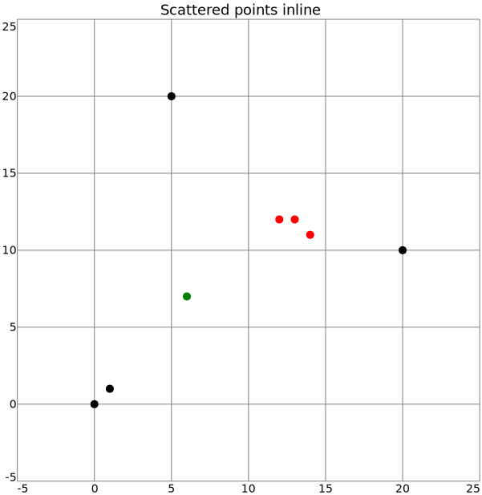
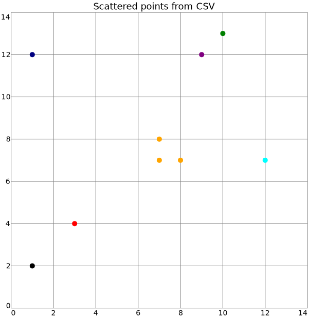

# plot

- [Examples](#examples)
  - [scatter](#scatter)
  - [scatter2](#scatter2)

- [Specification](#specification)

## Examples

### scatter



```yaml
chysl:
  version: 0.2.7
  software: Chysl (Python) 0.2.7
chart: plot
title: Scattered points inline
entries:
- entry: scatter
  data:
  - x: 5
    y: 20
  - x: 12
    y: 12.5
    color: red
    marker: alpha
  - x: 13
    y: 12
    color: red
    marker: beta
  - x: 14
    y: 11
    color: red
    marker: gamma
  - x: 19
    y: 9
    color: orange
    marker: '#'
  - x: 0
    y: 0
    size: 10
  - x: 1
    y: 1
  - x: 6
    y:
      value: 7
      error: 1
    color: lime
```
### scatter2



```yaml
chysl:
  version: 0.2.7
  software: Chysl (Python) 0.2.7
chart: plot
title: Scattered points from CSV
entries:
- entry: scatter
  data:
    source: scatter2.csv
```
## Specification

[JSON Schema](plot.md)

2D chart plotting x/y data; scatter, etc.

- **chart**:
  - *required*
  - *const* 'plot'
- **title**: Title of the plot.
  - *See* [text](schema_defs.md#text).
- **width**: Width of the chart, including legends etc.
  - *type*: float
  - *exclusiveMinimum*: 0
  - *default*: 600
- **xaxis**: X axis specification.
  - *See* [axis](schema_defs.md#axis).
- **yaxis**: Y axis specification.
  - *See* [axis](schema_defs.md#axis).
- **entries**: Sets of data with specified visualization.
  - *required*
  - *type*: sequence
  - *items*:
    - Alternative 1: Scatter plot.
      - *type*: mapping
      - **entry**:
        - *required*
        - *const* 'scatter'
      - **data**:
        - *See* [data_or_source](schema_defs.md#data_or_source).
        - *required*

