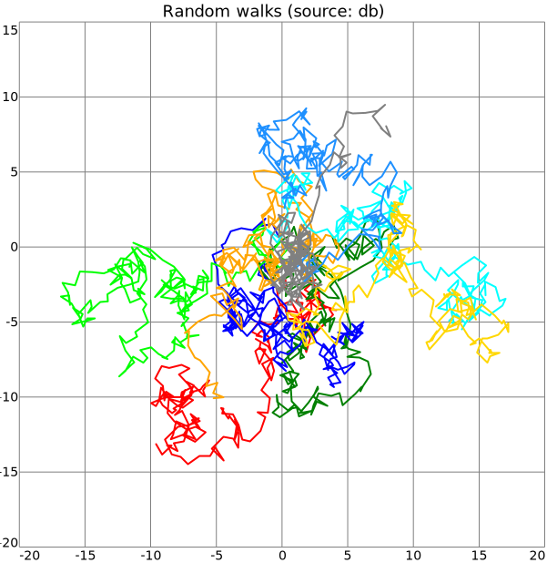

# plot2d

- [Examples](#examples)
  - [scatter_points](#scatter_points)
  - [scatter_iris](#scatter_iris)
  - [line_random_walks](#line_random_walks)

- [Specification](#specification)

## Examples

### scatter_points


```yaml
chysl:
  version: 0.2.11
  software: Chysl (Python) 0.2.11
chart: plot2d
title: Scattered points inline
entries:
- entry: scatter2d
  data:
  - x: 41.66198725453412
    y: 1.016916945706836
    size: 89.51239055522458
    color: blue
    opacity: 0.4493199275997964
    marker: disc
  - x: 36.84116894884757
    y: 19.366134904507426
    size: 73.96049012373167
    color: red
    opacity: 0.3808439119646841
    marker: alpha
  - x: 12.426688428353017
    y: 43.29362680099159
    size: 73.72470928455058
    color: green
    opacity: 0.3871717803618659
    marker: mars
  - x: 55.32210855693298
    y: 35.490138633659875
    size: 97.48388710597291
    color: purple
    opacity: 0.34564704943836755
    marker: disc
  - x: 97.863999557041
    y: 41.2119392939301
    size: 70.23612208660225
    color: cyan
    opacity: 0.3740730844650946
    marker: alpha
  - x: 71.8967140300885
    y: 18.997137872182034
    size: 60.49362554641313
    color: orange
    opacity: 0.31176060907110026
    marker: mars
  - x: 33.95177723979207
    y: 96.74824588798714
    size: 98.72790725113941
    color: lime
    opacity: 0.6722650200705174
    marker: disc
  - x: 0.3454610755095566
    y: 94.02385030977428
    size: 92.24601812532859
    color: black
    opacity: 0.6854171692584055
    marker: alpha
  - x: 17.88737646235151
    y: 9.94996328096114
    size: 64.87194811071146
    color: blue
    opacity: 0.7427682335727397
    marker: mars
  - x: 57.80860273663232
    y: 73.65822149440822
    size: 53.95726619370446
    color: red
    opacity: 0.5617987900823291
    marker: disc
  - x: 70.93864374841317
    y: 82.48339468977807
    size: 88.42747198354498
    color: green
    opacity: 0.41615405648873105
    marker: alpha
  - x: 87.31899671198792
    y: 21.63804302900447
    size: 88.11395425619887
    color: purple
    opacity: 0.5775426494691887
    marker: mars
  - x: 18.582835985521594
    y: 58.8608618331516
    size: 71.09436314524501
    color: cyan
    opacity: 0.7793312517176161
    marker: disc
  - x: 4.153922185136183
    y: 16.413828210031
    size: 98.99755918885067
    color: orange
    opacity: 0.7161024429252615
    marker: alpha
  - x: 15.027246598161915
    y: 22.911297045444933
    size: 72.34829649715135
    color: lime
    opacity: 0.3784904151633868
    marker: mars
  - x: 32.37607256534856
    y: 4.931922302313108
    size: 82.70063762893398
    color: black
    opacity: 0.3392813734266923
    marker: disc
  - x: 99.46042507818163
    y: 92.05698384306194
    size: 87.32973233388773
    color: blue
    opacity: 0.686202945233638
    marker: alpha
  - x: 36.77523003172184
    y: 67.87061729470147
    size: 85.67552601762335
    color: red
    opacity: 0.5403881274977664
    marker: mars
  - x: 6.1525046928359135
    y: 62.61039487405924
    size: 59.54564993321353
    color: green
    opacity: 0.6050445354210666
    marker: disc
  - x: 42.082846107038975
    y: 95.25307830408943
    size: 52.095676972398344
    color: purple
    opacity: 0.6844281832234802
    marker: alpha
  - x: 69.85618555499734
    y: 55.65629985158106
    size: 44.80277664731132
    color: cyan
    opacity: 0.3824758555460905
    marker: mars
  - x: 96.72819773521698
    y: 23.064252885618973
    size: 49.812581909934636
    color: orange
    opacity: 0.44414783623123366
    marker: disc
  - x: 53.71205291941445
    y: 51.961333822995634
    size: 40.199908679667814
    color: lime
    opacity: 0.3015924820962709
    marker: alpha
  - x: 49.60664874757757
    y: 18.48544913177429
    size: 76.45005014560031
    color: black
    opacity: 0.6992315152682786
    marker: mars
  - x: 9.587326842754095
    y: 50.51671769471715
    size: 64.36828735446176
    color: blue
    opacity: 0.6952266415635342
    marker: disc
```
### scatter_iris

[CSV data file](scatter_iris.csv)


```yaml
chysl:
  version: 0.2.11
  software: Chysl (Python) 0.2.11
chart: column
title:
  text: Iris flower measurements
  size: 30
entries:
- chart: row
  entries:
  - chart: note
    body:
      text: Sepal length
      size: 24
    frame: 0
    background: white
  - chart: plot2d
    entries:
    - entry: scatter2d
      data:
        source: scatter_iris.csv
        parameters:
          x: sepal width
          y: sepal length
          color:
            field: class
            map:
              Iris-setosa: red
              Iris-versicolor: green
              Iris-virginica: blue
          marker:
            field: class
            map:
              Iris-setosa: circle
              Iris-versicolor: triangle
              Iris-virginica: square
    width: 300
  - chart: plot2d
    entries:
    - entry: scatter2d
      data:
        source: scatter_iris.csv
        parameters:
          x: petal length
          y: sepal length
          color:
            field: class
            map:
              Iris-setosa: red
              Iris-versicolor: green
              Iris-virginica: blue
          marker:
            field: class
            map:
              Iris-setosa: circle
              Iris-versicolor: triangle
              Iris-virginica: square
    width: 300
  - chart: plot2d
    entries:
    - entry: scatter2d
      data:
        source: scatter_iris.csv
        parameters:
          x: petal width
          y: sepal length
          color:
            field: class
            map:
              Iris-setosa: red
              Iris-versicolor: green
              Iris-virginica: blue
          marker:
            field: class
            map:
              Iris-setosa: circle
              Iris-versicolor: triangle
              Iris-virginica: square
    width: 300
- chart: row
  entries:
  - chart: plot2d
    entries:
    - entry: scatter2d
      data:
        source: scatter_iris.csv
        parameters:
          x: sepal length
          y: sepal width
          color:
            field: class
            map:
              Iris-setosa: red
              Iris-versicolor: green
              Iris-virginica: blue
          marker:
            field: class
            map:
              Iris-setosa: circle
              Iris-versicolor: triangle
              Iris-virginica: square
    width: 300
  - chart: note
    body:
      text: Sepal width
      size: 24
    frame: 0
    background: white
  - chart: plot2d
    entries:
    - entry: scatter2d
      data:
        source: scatter_iris.csv
        parameters:
          x: petal length
          y: sepal width
          color:
            field: class
            map:
              Iris-setosa: red
              Iris-versicolor: green
              Iris-virginica: blue
          marker:
            field: class
            map:
              Iris-setosa: circle
              Iris-versicolor: triangle
              Iris-virginica: square
    width: 300
  - chart: plot2d
    entries:
    - entry: scatter2d
      data:
        source: scatter_iris.csv
        parameters:
          x: petal width
          y: sepal width
          color:
            field: class
            map:
              Iris-setosa: red
              Iris-versicolor: green
              Iris-virginica: blue
          marker:
            field: class
            map:
              Iris-setosa: circle
              Iris-versicolor: triangle
              Iris-virginica: square
    width: 300
- chart: row
  entries:
  - chart: plot2d
    entries:
    - entry: scatter2d
      data:
        source: scatter_iris.csv
        parameters:
          x: sepal length
          y: petal length
          color:
            field: class
            map:
              Iris-setosa: red
              Iris-versicolor: green
              Iris-virginica: blue
          marker:
            field: class
            map:
              Iris-setosa: circle
              Iris-versicolor: triangle
              Iris-virginica: square
    width: 300
  - chart: plot2d
    entries:
    - entry: scatter2d
      data:
        source: scatter_iris.csv
        parameters:
          x: sepal width
          y: petal length
          color:
            field: class
            map:
              Iris-setosa: red
              Iris-versicolor: green
              Iris-virginica: blue
          marker:
            field: class
            map:
              Iris-setosa: circle
              Iris-versicolor: triangle
              Iris-virginica: square
    width: 300
  - chart: note
    body:
      text: Petal length
      size: 24
    frame: 0
    background: white
  - chart: plot2d
    entries:
    - entry: scatter2d
      data:
        source: scatter_iris.csv
        parameters:
          x: petal width
          y: petal length
          color:
            field: class
            map:
              Iris-setosa: red
              Iris-versicolor: green
              Iris-virginica: blue
          marker:
            field: class
            map:
              Iris-setosa: circle
              Iris-versicolor: triangle
              Iris-virginica: square
    width: 300
- chart: row
  entries:
  - chart: plot2d
    entries:
    - entry: scatter2d
      data:
        source: scatter_iris.csv
        parameters:
          x: sepal length
          y: petal width
          color:
            field: class
            map:
              Iris-setosa: red
              Iris-versicolor: green
              Iris-virginica: blue
          marker:
            field: class
            map:
              Iris-setosa: circle
              Iris-versicolor: triangle
              Iris-virginica: square
    width: 300
  - chart: plot2d
    entries:
    - entry: scatter2d
      data:
        source: scatter_iris.csv
        parameters:
          x: sepal width
          y: petal width
          color:
            field: class
            map:
              Iris-setosa: red
              Iris-versicolor: green
              Iris-virginica: blue
          marker:
            field: class
            map:
              Iris-setosa: circle
              Iris-versicolor: triangle
              Iris-virginica: square
    width: 300
  - chart: plot2d
    entries:
    - entry: scatter2d
      data:
        source: scatter_iris.csv
        parameters:
          x: petal length
          y: petal width
          color:
            field: class
            map:
              Iris-setosa: red
              Iris-versicolor: green
              Iris-virginica: blue
          marker:
            field: class
            map:
              Iris-setosa: circle
              Iris-versicolor: triangle
              Iris-virginica: square
    width: 300
  - chart: note
    body:
      text: Petal width
      size: 24
    frame: 0
    background: white
- chart: column
  entries:
  - chart: note
    body:
      text: 'Iris setosa: red circles'
      size: 24
      color: red
    frame: 0
    background: white
  - chart: note
    body:
      text: 'Iris versicolor: green triangles'
      size: 24
      color: green
    frame: 0
    background: white
  - chart: note
    body:
      text: 'Iris virginica: blue squares'
      size: 24
      color: blue
    frame: 0
    background: white
```
### line_random_walks

[Sqlite database file](line_random_walks.db)



```yaml
chysl:
  version: 0.2.11
  software: Chysl (Python) 0.2.11
chart: plot2d
title: 'Random walks (source: db)'
entries:
- entry: line2d
  color: red
  data:
    source:
      database: sqlite
      location: line_random_walks.db
      select: SELECT x, y FROM walks WHERE run=1 ORDER BY i
- entry: line2d
  color: green
  data:
    source:
      database: sqlite
      location: line_random_walks.db
      select: SELECT x, y FROM walks WHERE run=2 ORDER BY i
- entry: line2d
  color: blue
  data:
    source:
      database: sqlite
      location: line_random_walks.db
      select: SELECT x, y FROM walks WHERE run=3 ORDER BY i
- entry: line2d
  color: lime
  data:
    source:
      database: sqlite
      location: line_random_walks.db
      select: SELECT x, y FROM walks WHERE run=4 ORDER BY i
- entry: line2d
  color: orange
  data:
    source:
      database: sqlite
      location: line_random_walks.db
      select: SELECT x, y FROM walks WHERE run=5 ORDER BY i
- entry: line2d
  color: cyan
  data:
    source:
      database: sqlite
      location: line_random_walks.db
      select: SELECT x, y FROM walks WHERE run=6 ORDER BY i
- entry: line2d
  color: gold
  data:
    source:
      database: sqlite
      location: line_random_walks.db
      select: SELECT x, y FROM walks WHERE run=7 ORDER BY i
- entry: line2d
  color: dodgerblue
  data:
    source:
      database: sqlite
      location: line_random_walks.db
      select: SELECT x, y FROM walks WHERE run=8 ORDER BY i
- entry: line2d
  color: gray
  data:
    source:
      database: sqlite
      location: line_random_walks.db
      select: SELECT x, y FROM walks WHERE run=9 ORDER BY i
```
## Specification

[JSON Schema](plot2d.md)

2D chart plotting x/y data; scatter, etc.

- **chart**:
  - *required*
  - *const* 'plot2d'
- **title**: Title of the plot.
  - *See* [text](schema_defs.md#text).
- **width**: Width of the chart, including legends etc.
  - *type*: float
  - *exclusiveMinimum*: 0
  - *default*: 600
- **xaxis**: X axis specification.
  - *See* [axis](schema_defs.md#axis).
- **yaxis**: Y axis specification.
  - *See* [axis](schema_defs.md#axis).
- **entries**: Sets of data with specified visualization.
  - *required*
  - *type*: sequence
  - *items*:
    - Alternative 1: 2D scatter plot.
      - *type*: mapping
      - **entry**:
        - *required*
        - *const* 'scatter2d'
      - **data**:
        - *See* [items_or_source](schema_defs.md#items_or_source).
        - *required*
      - **size**: Default value when not given by data.
        - *See* [size](schema_defs.md#size).
        - *default*: 10
      - **color**: Default value when not given by data.
        - *See* [color](schema_defs.md#color).
      - **opacity**: Default value when not given by data.
        - *See* [opacity](schema_defs.md#opacity).
      - **marker**: Default value when not given by data.
        - *See* [marker](schema_defs.md#marker).
    - Alternative 2: 2D line plot.
      - *type*: mapping
      - **entry**:
        - *required*
        - *const* 'line2d'
      - **data**:
        - *See* [items_or_source](schema_defs.md#items_or_source).
        - *required*
      - **linewidth**: Width of the line.
        - *type*: float
        - *default*: 2
      - **color**: Color of the line.
        - *See* [color](schema_defs.md#color).
        - *default*: 'black'
      - **opacity**: Opacity of the line.
        - *See* [opacity](schema_defs.md#opacity).

