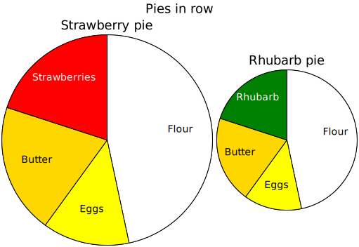

# row

- [Examples](#examples)
  - [pies_row](#pies_row)
  - [scatter_iris](#scatter_iris)

- [Specification](#specification)

## Examples

### pies_row



```yaml
chysl: 0.4.2
chart: row
title: Pies in row
subcharts:
- chart: piechart
  title: Strawberry pie
  diameter: 300
  palette:
  - white
  - yellow
  - gold
  - red
  slices:
  - x: 7
    label: Flour
  - x: 2
    label: Eggs
  - x: 3
    label: Butter
  - x: 3
    label: Strawberries
    href: https://en.wikipedia.org/wiki/Strawberry
- chart: piechart
  title: Rhubarb pie
  palette:
  - white
  - yellow
  - gold
  - red
  slices:
  - x: 7
    label: Flour
  - x: 2
    label: Eggs
  - x: 3
    label: Butter
  - x: 3
    label: Rhubarb
    color: green
    href: https://en.wikipedia.org/wiki/Rhubarb
padding: 10
```
### scatter_iris

[CSV data file](scatter_iris.csv)


```yaml
chysl: 0.4.2
chart: column
title:
  size: 30
  text: Iris flower measurements
subcharts:
- chart: row
  subcharts:
  - chart: column
    subcharts:
    - chart: scatter2d
      width: 300
      height: 300
      xaxis:
        labels: false
      yaxis:
        caption: Sepal length
      size: 6
      points:
        source: scatter_iris.csv
        parameters:
          x: sepal length
          y: sepal length
          color:
            field: class
            map:
              Iris-setosa: red
              Iris-versicolor: green
              Iris-virginica: blue
          marker:
            field: class
            map:
              Iris-setosa: circle
              Iris-versicolor: triangle
              Iris-virginica: square
    - chart: scatter2d
      width: 300
      height: 300
      xaxis:
        labels: false
      yaxis:
        caption: Sepal width
      size: 6
      points:
        source: scatter_iris.csv
        parameters:
          x: sepal length
          y: sepal width
          color:
            field: class
            map:
              Iris-setosa: red
              Iris-versicolor: green
              Iris-virginica: blue
          marker:
            field: class
            map:
              Iris-setosa: circle
              Iris-versicolor: triangle
              Iris-virginica: square
    - chart: scatter2d
      width: 300
      height: 300
      xaxis:
        labels: false
      yaxis:
        caption: Petal length
      size: 6
      points:
        source: scatter_iris.csv
        parameters:
          x: sepal length
          y: petal length
          color:
            field: class
            map:
              Iris-setosa: red
              Iris-versicolor: green
              Iris-virginica: blue
          marker:
            field: class
            map:
              Iris-setosa: circle
              Iris-versicolor: triangle
              Iris-virginica: square
    - chart: scatter2d
      width: 300
      height: 300
      xaxis:
        caption: Sepal length
      yaxis:
        caption: Petal width
      size: 6
      points:
        source: scatter_iris.csv
        parameters:
          x: sepal length
          y: petal width
          color:
            field: class
            map:
              Iris-setosa: red
              Iris-versicolor: green
              Iris-virginica: blue
          marker:
            field: class
            map:
              Iris-setosa: circle
              Iris-versicolor: triangle
              Iris-virginica: square
    align: right
    padding: 4
  - chart: column
    subcharts:
    - chart: scatter2d
      width: 300
      height: 300
      xaxis:
        labels: false
      yaxis:
        labels: false
      size: 6
      points:
        source: scatter_iris.csv
        parameters:
          x: sepal width
          y: sepal length
          color:
            field: class
            map:
              Iris-setosa: red
              Iris-versicolor: green
              Iris-virginica: blue
          marker:
            field: class
            map:
              Iris-setosa: circle
              Iris-versicolor: triangle
              Iris-virginica: square
    - chart: scatter2d
      width: 300
      height: 300
      xaxis:
        labels: false
      yaxis:
        labels: false
      size: 6
      points:
        source: scatter_iris.csv
        parameters:
          x: sepal width
          y: sepal width
          color:
            field: class
            map:
              Iris-setosa: red
              Iris-versicolor: green
              Iris-virginica: blue
          marker:
            field: class
            map:
              Iris-setosa: circle
              Iris-versicolor: triangle
              Iris-virginica: square
    - chart: scatter2d
      width: 300
      height: 300
      xaxis:
        labels: false
      yaxis:
        labels: false
      size: 6
      points:
        source: scatter_iris.csv
        parameters:
          x: sepal width
          y: petal length
          color:
            field: class
            map:
              Iris-setosa: red
              Iris-versicolor: green
              Iris-virginica: blue
          marker:
            field: class
            map:
              Iris-setosa: circle
              Iris-versicolor: triangle
              Iris-virginica: square
    - chart: scatter2d
      width: 300
      height: 300
      xaxis:
        caption: Sepal width
      yaxis:
        labels: false
      size: 6
      points:
        source: scatter_iris.csv
        parameters:
          x: sepal width
          y: petal width
          color:
            field: class
            map:
              Iris-setosa: red
              Iris-versicolor: green
              Iris-virginica: blue
          marker:
            field: class
            map:
              Iris-setosa: circle
              Iris-versicolor: triangle
              Iris-virginica: square
    align: right
    padding: 4
  - chart: column
    subcharts:
    - chart: scatter2d
      width: 300
      height: 300
      xaxis:
        labels: false
      yaxis:
        labels: false
      size: 6
      points:
        source: scatter_iris.csv
        parameters:
          x: petal length
          y: sepal length
          color:
            field: class
            map:
              Iris-setosa: red
              Iris-versicolor: green
              Iris-virginica: blue
          marker:
            field: class
            map:
              Iris-setosa: circle
              Iris-versicolor: triangle
              Iris-virginica: square
    - chart: scatter2d
      width: 300
      height: 300
      xaxis:
        labels: false
      yaxis:
        labels: false
      size: 6
      points:
        source: scatter_iris.csv
        parameters:
          x: petal length
          y: sepal width
          color:
            field: class
            map:
              Iris-setosa: red
              Iris-versicolor: green
              Iris-virginica: blue
          marker:
            field: class
            map:
              Iris-setosa: circle
              Iris-versicolor: triangle
              Iris-virginica: square
    - chart: scatter2d
      width: 300
      height: 300
      xaxis:
        labels: false
      yaxis:
        labels: false
      size: 6
      points:
        source: scatter_iris.csv
        parameters:
          x: petal length
          y: petal length
          color:
            field: class
            map:
              Iris-setosa: red
              Iris-versicolor: green
              Iris-virginica: blue
          marker:
            field: class
            map:
              Iris-setosa: circle
              Iris-versicolor: triangle
              Iris-virginica: square
    - chart: scatter2d
      width: 300
      height: 300
      xaxis:
        caption: Petal length
      yaxis:
        labels: false
      size: 6
      points:
        source: scatter_iris.csv
        parameters:
          x: petal length
          y: petal width
          color:
            field: class
            map:
              Iris-setosa: red
              Iris-versicolor: green
              Iris-virginica: blue
          marker:
            field: class
            map:
              Iris-setosa: circle
              Iris-versicolor: triangle
              Iris-virginica: square
    align: right
    padding: 4
  - chart: column
    subcharts:
    - chart: scatter2d
      width: 300
      height: 300
      xaxis:
        labels: false
      yaxis:
        labels: false
      size: 6
      points:
        source: scatter_iris.csv
        parameters:
          x: petal width
          y: sepal length
          color:
            field: class
            map:
              Iris-setosa: red
              Iris-versicolor: green
              Iris-virginica: blue
          marker:
            field: class
            map:
              Iris-setosa: circle
              Iris-versicolor: triangle
              Iris-virginica: square
    - chart: scatter2d
      width: 300
      height: 300
      xaxis:
        labels: false
      yaxis:
        labels: false
      size: 6
      points:
        source: scatter_iris.csv
        parameters:
          x: petal width
          y: sepal width
          color:
            field: class
            map:
              Iris-setosa: red
              Iris-versicolor: green
              Iris-virginica: blue
          marker:
            field: class
            map:
              Iris-setosa: circle
              Iris-versicolor: triangle
              Iris-virginica: square
    - chart: scatter2d
      width: 300
      height: 300
      xaxis:
        labels: false
      yaxis:
        labels: false
      size: 6
      points:
        source: scatter_iris.csv
        parameters:
          x: petal width
          y: petal length
          color:
            field: class
            map:
              Iris-setosa: red
              Iris-versicolor: green
              Iris-virginica: blue
          marker:
            field: class
            map:
              Iris-setosa: circle
              Iris-versicolor: triangle
              Iris-virginica: square
    - chart: scatter2d
      width: 300
      height: 300
      xaxis:
        caption: Petal width
      yaxis:
        labels: false
      size: 6
      points:
        source: scatter_iris.csv
        parameters:
          x: petal width
          y: petal width
          color:
            field: class
            map:
              Iris-setosa: red
              Iris-versicolor: green
              Iris-virginica: blue
          marker:
            field: class
            map:
              Iris-setosa: circle
              Iris-versicolor: triangle
              Iris-virginica: square
    align: right
    padding: 4
  padding: 4
- chart: column
  subcharts:
  - chart: note
    body:
      size: 24
      color: red
      text: 'Iris setosa: red circles'
    frame: false
    background: white
  - chart: note
    body:
      size: 24
      color: green
      text: 'Iris versicolor: green triangles'
    frame: false
    background: white
  - chart: note
    body:
      size: 24
      color: blue
      text: 'Iris virginica: blue squares'
    frame: false
    background: white
padding: 4
```
## Specification

[JSON Schema](row.md)

Charts arranged in a row.

- **chart**:
  - *required*
  - *const* 'row'
- **title**: Title of the chart.
  - *See* [text](schema_defs.md#text).
- **description**: Description of the chart. Rendered as <desc> in SVG.
  - *type*: string
- **align**: Align charts vertically within the row.
  - *one of*: 'bottom', 'middle', 'top'
  - *default*: 'middle'
- **padding**: Padding between the subcharts.
  - *type*: float
  - *minimum*: 0
  - *default*: 0
- **subcharts**: Charts in the row.
  - *required*
  - *type*: sequence
  - *items*:
    - *See* [chart_or_include](schema_defs.md#chart_or_include).

