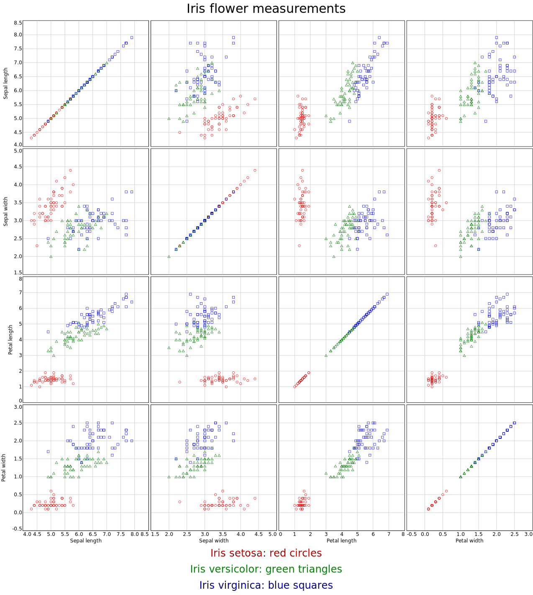
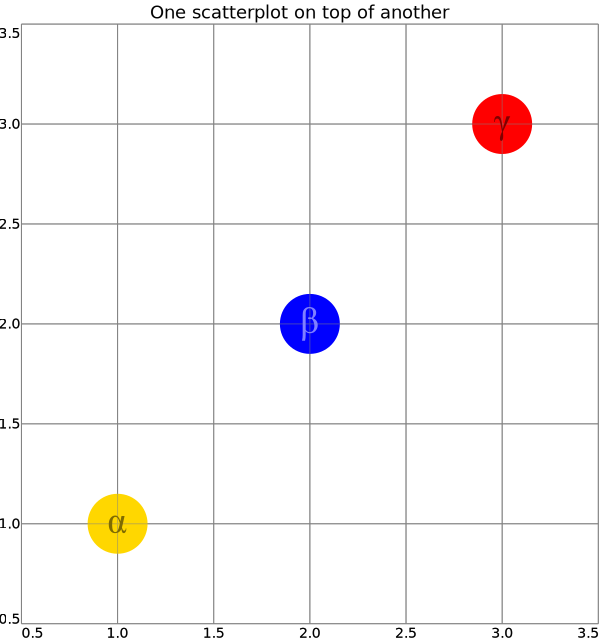

# scatter2d

- [Examples](#examples)
  - [scatter_points](#scatter_points)
  - [scatter_iris](#scatter_iris)
  - [overlay](#overlay)

- [Specification](#specification)

## Examples

### scatter_points


```yaml
chysl: 0.3.6
chart: scatter2d
title: Scattered points inline
points:
- x: 41.66198725453412
  y: 1.016916945706836
  color: blue
  marker: disc
  size: 89.51239055522458
  opacity: 0.4493199275997964
- x: 36.84116894884757
  y: 19.366134904507426
  color: red
  marker: alpha
  size: 73.96049012373167
  opacity: 0.3808439119646841
- x: 12.426688428353017
  y: 43.29362680099159
  color: green
  marker: mars
  size: 73.72470928455058
  opacity: 0.3871717803618659
- x: 55.32210855693298
  y: 35.490138633659875
  color: purple
  marker: disc
  size: 97.48388710597291
  opacity: 0.34564704943836755
- x: 97.863999557041
  y: 41.2119392939301
  color: cyan
  marker: alpha
  size: 70.23612208660225
  opacity: 0.3740730844650946
- x: 71.8967140300885
  y: 18.997137872182034
  color: orange
  marker: mars
  size: 60.49362554641313
  opacity: 0.31176060907110026
- x: 33.95177723979207
  y: 96.74824588798714
  color: lime
  marker: disc
  size: 98.72790725113941
  opacity: 0.6722650200705174
- x: 0.3454610755095566
  y: 94.02385030977428
  color: black
  marker: alpha
  size: 92.24601812532859
  opacity: 0.6854171692584055
- x: 17.88737646235151
  y: 9.94996328096114
  color: blue
  marker: mars
  size: 64.87194811071146
  opacity: 0.7427682335727397
- x: 57.80860273663232
  y: 73.65822149440822
  color: red
  marker: disc
  size: 53.95726619370446
  opacity: 0.5617987900823291
- x: 70.93864374841317
  y: 82.48339468977807
  color: green
  marker: alpha
  size: 88.42747198354498
  opacity: 0.41615405648873105
- x: 87.31899671198792
  y: 21.63804302900447
  color: purple
  marker: mars
  size: 88.11395425619887
  opacity: 0.5775426494691887
- x: 18.582835985521594
  y: 58.8608618331516
  color: cyan
  marker: disc
  size: 71.09436314524501
  opacity: 0.7793312517176161
- x: 4.153922185136183
  y: 16.413828210031
  color: orange
  marker: alpha
  size: 98.99755918885067
  opacity: 0.7161024429252615
- x: 15.027246598161915
  y: 22.911297045444933
  color: lime
  marker: mars
  size: 72.34829649715135
  opacity: 0.3784904151633868
- x: 32.37607256534856
  y: 4.931922302313108
  color: black
  marker: disc
  size: 82.70063762893398
  opacity: 0.3392813734266923
- x: 99.46042507818163
  y: 92.05698384306194
  color: blue
  marker: alpha
  size: 87.32973233388773
  opacity: 0.686202945233638
- x: 36.77523003172184
  y: 67.87061729470147
  color: red
  marker: mars
  size: 85.67552601762335
  opacity: 0.5403881274977664
- x: 6.1525046928359135
  y: 62.61039487405924
  color: green
  marker: disc
  size: 59.54564993321353
  opacity: 0.6050445354210666
- x: 42.082846107038975
  y: 95.25307830408943
  color: purple
  marker: alpha
  size: 52.095676972398344
  opacity: 0.6844281832234802
- x: 69.85618555499734
  y: 55.65629985158106
  color: cyan
  marker: mars
  size: 44.80277664731132
  opacity: 0.3824758555460905
- x: 96.72819773521698
  y: 23.064252885618973
  color: orange
  marker: disc
  size: 49.812581909934636
  opacity: 0.44414783623123366
- x: 53.71205291941445
  y: 51.961333822995634
  color: lime
  marker: alpha
  size: 40.199908679667814
  opacity: 0.3015924820962709
- x: 49.60664874757757
  y: 18.48544913177429
  color: black
  marker: mars
  size: 76.45005014560031
  opacity: 0.6992315152682786
- x: 9.587326842754095
  y: 50.51671769471715
  color: blue
  marker: disc
  size: 64.36828735446176
  opacity: 0.6952266415635342
```
### scatter_iris

[CSV data file](scatter_iris.csv)



```yaml
chysl: 0.3.6
chart: column
title:
  text: Iris flower measurements
  size: 30
subcharts:
- chart: row
  subcharts:
  - chart: scatter2d
    width: 300
    xaxis:
      min: 4
      max: 8
      labels: false
    yaxis:
      min: 4
      max: 8
      labels: true
      width: 24
    size: 6
    points:
      source: scatter_iris.csv
      parameters:
        x: sepal length
        y: sepal length
        color:
          field: class
          map:
            Iris-setosa: red
            Iris-versicolor: green
            Iris-virginica: blue
        marker:
          field: class
          map:
            Iris-setosa: circle
            Iris-versicolor: triangle
            Iris-virginica: square
  - chart: scatter2d
    width: 300
    xaxis:
      min: 2
      max: 4.5
      labels: false
    yaxis:
      min: 4
      max: 8
      labels: false
      width: 24
    size: 6
    points:
      source: scatter_iris.csv
      parameters:
        x: sepal width
        y: sepal length
        color:
          field: class
          map:
            Iris-setosa: red
            Iris-versicolor: green
            Iris-virginica: blue
        marker:
          field: class
          map:
            Iris-setosa: circle
            Iris-versicolor: triangle
            Iris-virginica: square
  - chart: scatter2d
    width: 300
    xaxis:
      min: 0.5
      max: 7.5
      labels: false
    yaxis:
      min: 4
      max: 8
      labels: false
      width: 24
    size: 6
    points:
      source: scatter_iris.csv
      parameters:
        x: petal length
        y: sepal length
        color:
          field: class
          map:
            Iris-setosa: red
            Iris-versicolor: green
            Iris-virginica: blue
        marker:
          field: class
          map:
            Iris-setosa: circle
            Iris-versicolor: triangle
            Iris-virginica: square
  - chart: scatter2d
    width: 300
    xaxis:
      min: 0
      max: 3
      labels: false
    yaxis:
      min: 4
      max: 8
      labels: false
      width: 24
    size: 6
    points:
      source: scatter_iris.csv
      parameters:
        x: petal width
        y: sepal length
        color:
          field: class
          map:
            Iris-setosa: red
            Iris-versicolor: green
            Iris-virginica: blue
        marker:
          field: class
          map:
            Iris-setosa: circle
            Iris-versicolor: triangle
            Iris-virginica: square
  padding: 4
- chart: row
  subcharts:
  - chart: scatter2d
    width: 300
    xaxis:
      min: 4
      max: 8
      labels: false
    yaxis:
      min: 2
      max: 4.5
      labels: true
      width: 24
    size: 6
    points:
      source: scatter_iris.csv
      parameters:
        x: sepal length
        y: sepal width
        color:
          field: class
          map:
            Iris-setosa: red
            Iris-versicolor: green
            Iris-virginica: blue
        marker:
          field: class
          map:
            Iris-setosa: circle
            Iris-versicolor: triangle
            Iris-virginica: square
  - chart: scatter2d
    width: 300
    xaxis:
      min: 2
      max: 4.5
      labels: false
    yaxis:
      min: 2
      max: 4.5
      labels: false
      width: 24
    size: 6
    points:
      source: scatter_iris.csv
      parameters:
        x: sepal width
        y: sepal width
        color:
          field: class
          map:
            Iris-setosa: red
            Iris-versicolor: green
            Iris-virginica: blue
        marker:
          field: class
          map:
            Iris-setosa: circle
            Iris-versicolor: triangle
            Iris-virginica: square
  - chart: scatter2d
    width: 300
    xaxis:
      min: 0.5
      max: 7.5
      labels: false
    yaxis:
      min: 2
      max: 4.5
      labels: false
      width: 24
    size: 6
    points:
      source: scatter_iris.csv
      parameters:
        x: petal length
        y: sepal width
        color:
          field: class
          map:
            Iris-setosa: red
            Iris-versicolor: green
            Iris-virginica: blue
        marker:
          field: class
          map:
            Iris-setosa: circle
            Iris-versicolor: triangle
            Iris-virginica: square
  - chart: scatter2d
    width: 300
    xaxis:
      min: 0
      max: 3
      labels: false
    yaxis:
      min: 2
      max: 4.5
      labels: false
      width: 24
    size: 6
    points:
      source: scatter_iris.csv
      parameters:
        x: petal width
        y: sepal width
        color:
          field: class
          map:
            Iris-setosa: red
            Iris-versicolor: green
            Iris-virginica: blue
        marker:
          field: class
          map:
            Iris-setosa: circle
            Iris-versicolor: triangle
            Iris-virginica: square
  padding: 4
- chart: row
  subcharts:
  - chart: scatter2d
    width: 300
    xaxis:
      min: 4
      max: 8
      labels: false
    yaxis:
      min: 0.5
      max: 7.5
      labels: true
      width: 24
    size: 6
    points:
      source: scatter_iris.csv
      parameters:
        x: sepal length
        y: petal length
        color:
          field: class
          map:
            Iris-setosa: red
            Iris-versicolor: green
            Iris-virginica: blue
        marker:
          field: class
          map:
            Iris-setosa: circle
            Iris-versicolor: triangle
            Iris-virginica: square
  - chart: scatter2d
    width: 300
    xaxis:
      min: 2
      max: 4.5
      labels: false
    yaxis:
      min: 0.5
      max: 7.5
      labels: false
      width: 24
    size: 6
    points:
      source: scatter_iris.csv
      parameters:
        x: sepal width
        y: petal length
        color:
          field: class
          map:
            Iris-setosa: red
            Iris-versicolor: green
            Iris-virginica: blue
        marker:
          field: class
          map:
            Iris-setosa: circle
            Iris-versicolor: triangle
            Iris-virginica: square
  - chart: scatter2d
    width: 300
    xaxis:
      min: 0.5
      max: 7.5
      labels: false
    yaxis:
      min: 0.5
      max: 7.5
      labels: false
      width: 24
    size: 6
    points:
      source: scatter_iris.csv
      parameters:
        x: petal length
        y: petal length
        color:
          field: class
          map:
            Iris-setosa: red
            Iris-versicolor: green
            Iris-virginica: blue
        marker:
          field: class
          map:
            Iris-setosa: circle
            Iris-versicolor: triangle
            Iris-virginica: square
  - chart: scatter2d
    width: 300
    xaxis:
      min: 0
      max: 3
      labels: false
    yaxis:
      min: 0.5
      max: 7.5
      labels: false
      width: 24
    size: 6
    points:
      source: scatter_iris.csv
      parameters:
        x: petal width
        y: petal length
        color:
          field: class
          map:
            Iris-setosa: red
            Iris-versicolor: green
            Iris-virginica: blue
        marker:
          field: class
          map:
            Iris-setosa: circle
            Iris-versicolor: triangle
            Iris-virginica: square
  padding: 4
- chart: row
  subcharts:
  - chart: scatter2d
    width: 300
    xaxis:
      min: 4
      max: 8
      caption: Sepal length
      labels: true
    yaxis:
      min: 0
      max: 3
      labels: true
      width: 24
    size: 6
    points:
      source: scatter_iris.csv
      parameters:
        x: sepal length
        y: petal width
        color:
          field: class
          map:
            Iris-setosa: red
            Iris-versicolor: green
            Iris-virginica: blue
        marker:
          field: class
          map:
            Iris-setosa: circle
            Iris-versicolor: triangle
            Iris-virginica: square
  - chart: scatter2d
    width: 300
    xaxis:
      min: 2
      max: 4.5
      caption: Sepal width
      labels: true
    yaxis:
      min: 0
      max: 3
      labels: false
      width: 24
    size: 6
    points:
      source: scatter_iris.csv
      parameters:
        x: sepal width
        y: petal width
        color:
          field: class
          map:
            Iris-setosa: red
            Iris-versicolor: green
            Iris-virginica: blue
        marker:
          field: class
          map:
            Iris-setosa: circle
            Iris-versicolor: triangle
            Iris-virginica: square
  - chart: scatter2d
    width: 300
    xaxis:
      min: 0.5
      max: 7.5
      caption: Petal length
      labels: true
    yaxis:
      min: 0
      max: 3
      labels: false
      width: 24
    size: 6
    points:
      source: scatter_iris.csv
      parameters:
        x: petal length
        y: petal width
        color:
          field: class
          map:
            Iris-setosa: red
            Iris-versicolor: green
            Iris-virginica: blue
        marker:
          field: class
          map:
            Iris-setosa: circle
            Iris-versicolor: triangle
            Iris-virginica: square
  - chart: scatter2d
    width: 300
    xaxis:
      min: 0
      max: 3
      caption: Petal width
      labels: true
    yaxis:
      min: 0
      max: 3
      labels: false
      width: 24
    size: 6
    points:
      source: scatter_iris.csv
      parameters:
        x: petal width
        y: petal width
        color:
          field: class
          map:
            Iris-setosa: red
            Iris-versicolor: green
            Iris-virginica: blue
        marker:
          field: class
          map:
            Iris-setosa: circle
            Iris-versicolor: triangle
            Iris-virginica: square
  padding: 4
- chart: column
  subcharts:
  - chart: note
    body:
      text: 'Iris setosa: red circles'
      size: 24
      color: red
    frame: 0
    background: white
  - chart: note
    body:
      text: 'Iris versicolor: green triangles'
      size: 24
      color: green
    frame: 0
    background: white
  - chart: note
    body:
      text: 'Iris virginica: blue squares'
      size: 24
      color: blue
    frame: 0
    background: white
  padding: 0
padding: 4
```
### overlay



```yaml
chysl: 0.3.6
chart: overlay
title: One scatterplot on top of another
layers:
- subchart:
    chart: scatter2d
    size: 60
    points:
    - x: 1
      y: 1
      color: gold
      href: https://en.wikipedia.org/wiki/Gold
    - x: 2
      y: 2
      color: blue
    - x: 3
      y: 3
      color: red
- opacity: 0.5
  subchart:
    chart: scatter2d
    size: 30
    points:
    - x: 1
      y: 1
      marker: alpha
    - x: 2
      y: 2
      marker: beta
      color: white
    - x: 3
      y: 3
      marker: gamma
```
## Specification

[JSON Schema](scatter2d.md)

2D scatter chart.

- **chart**:
  - *required*
  - *const* 'scatter2d'
- **title**:
  - *See* [title](schema_defs.md#title).
- **description**:
  - *See* [description](schema_defs.md#description).
- **width**: Width of the chart, including legends etc.
  - *type*: float
  - *exclusiveMinimum*: 0
  - *default*: 600
- **xaxis**: X axis specification.
  - *See* [axis](schema_defs.md#axis).
- **yaxis**: Y axis specification.
  - *See* [axis](schema_defs.md#axis).
- **xgrid**: X grid specification.
  - *See* [grid](schema_defs.md#grid).
- **ygrid**: Y grid specification.
  - *See* [grid](schema_defs.md#grid).
- **marker**: Default marker.
  - *See* [marker](schema_defs.md#marker).
  - *default*: 'disc'
- **size**: Default size.
  - *See* [size](schema_defs.md#size).
  - *default*: 10
- **color**: Default color.
  - *See* [color](schema_defs.md#color).
  - *default*: 'black'
- **opacity**: Default opacity.
  - *See* [opacity](schema_defs.md#opacity).
- **points**: A container of 2D points to display as markers.
  - *See* [datapoints](schema_defs.md#datapoints).
  - *required*

