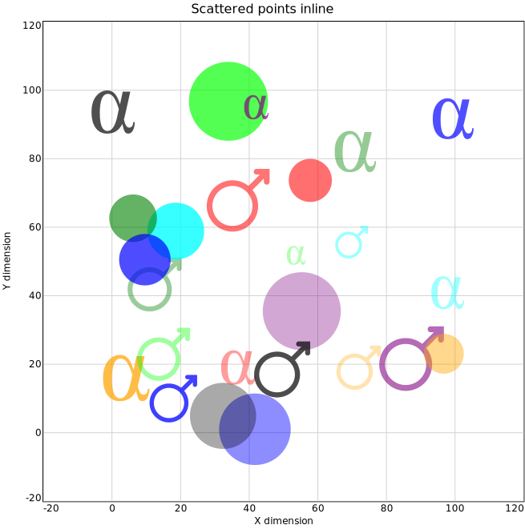

# scatter2d

- [Examples](#examples)
  - [scatter_points](#scatter_points)
  - [scatter_iris](#scatter_iris)
  - [markers](#markers)
  - [points_marks](#points_marks)

- [Specification](#specification)

## Examples

### scatter_points



```yaml
chysl: 0.4.1
chart: scatter2d
title: Scattered points inline
xaxis:
  caption: X dimension
yaxis:
  caption: Y dimension
points:
- x: 41.66198725453412
  y: 1.016916945706836
  size: 89.51239055522458
  color: blue
  marker: disc
  opacity: 0.4493199275997964
- x: 36.84116894884757
  y: 19.366134904507426
  size: 73.96049012373167
  color: red
  marker: alpha
  opacity: 0.3808439119646841
- x: 12.426688428353017
  y: 43.29362680099159
  size: 73.72470928455058
  color: green
  marker: mars
  opacity: 0.3871717803618659
- x: 55.32210855693298
  y: 35.490138633659875
  size: 97.48388710597291
  color: purple
  marker: disc
  opacity: 0.34564704943836755
- x: 97.863999557041
  y: 41.2119392939301
  size: 70.23612208660225
  color: cyan
  marker: alpha
  opacity: 0.3740730844650946
- x: 71.8967140300885
  y: 18.997137872182034
  size: 60.49362554641313
  color: orange
  marker: mars
  opacity: 0.31176060907110026
- x: 33.95177723979207
  y: 96.74824588798714
  size: 98.72790725113941
  color: lime
  marker: disc
  opacity: 0.6722650200705174
- x: 0.3454610755095566
  y: 94.02385030977428
  size: 92.24601812532859
  color: black
  marker: alpha
  opacity: 0.6854171692584055
- x: 17.88737646235151
  y: 9.94996328096114
  size: 64.87194811071146
  color: blue
  marker: mars
  opacity: 0.7427682335727397
- x: 57.80860273663232
  y: 73.65822149440822
  size: 53.95726619370446
  color: red
  marker: disc
  opacity: 0.5617987900823291
- x: 70.93864374841317
  y: 82.48339468977807
  size: 88.42747198354498
  color: green
  marker: alpha
  opacity: 0.41615405648873105
- x: 87.31899671198792
  y: 21.63804302900447
  size: 88.11395425619887
  color: purple
  marker: mars
  opacity: 0.5775426494691887
- x: 18.582835985521594
  y: 58.8608618331516
  size: 71.09436314524501
  color: cyan
  marker: disc
  opacity: 0.7793312517176161
- x: 4.153922185136183
  y: 16.413828210031
  size: 98.99755918885067
  color: orange
  marker: alpha
  opacity: 0.7161024429252615
- x: 15.027246598161915
  y: 22.911297045444933
  size: 72.34829649715135
  color: lime
  marker: mars
  opacity: 0.3784904151633868
- x: 32.37607256534856
  y: 4.931922302313108
  size: 82.70063762893398
  color: black
  marker: disc
  opacity: 0.3392813734266923
- x: 99.46042507818163
  y: 92.05698384306194
  size: 87.32973233388773
  color: blue
  marker: alpha
  opacity: 0.686202945233638
- x: 36.77523003172184
  y: 67.87061729470147
  size: 85.67552601762335
  color: red
  marker: mars
  opacity: 0.5403881274977664
- x: 6.1525046928359135
  y: 62.61039487405924
  size: 59.54564993321353
  color: green
  marker: disc
  opacity: 0.6050445354210666
- x: 42.082846107038975
  y: 95.25307830408943
  size: 52.095676972398344
  color: purple
  marker: alpha
  opacity: 0.6844281832234802
- x: 69.85618555499734
  y: 55.65629985158106
  size: 44.80277664731132
  color: cyan
  marker: mars
  opacity: 0.3824758555460905
- x: 96.72819773521698
  y: 23.064252885618973
  size: 49.812581909934636
  color: orange
  marker: disc
  opacity: 0.44414783623123366
- x: 53.71205291941445
  y: 51.961333822995634
  size: 40.199908679667814
  color: lime
  marker: alpha
  opacity: 0.3015924820962709
- x: 49.60664874757757
  y: 18.48544913177429
  size: 76.45005014560031
  color: black
  marker: mars
  opacity: 0.6992315152682786
- x: 9.587326842754095
  y: 50.51671769471715
  size: 64.36828735446176
  color: blue
  marker: disc
  opacity: 0.6952266415635342
```
### scatter_iris

[CSV data file](scatter_iris.csv)


```yaml
chysl: 0.4.1
chart: column
title:
  size: 30
  text: Iris flower measurements
subcharts:
- chart: row
  subcharts:
  - chart: column
    subcharts:
    - chart: scatter2d
      width: 300
      height: 300
      xaxis:
        labels: false
      yaxis:
        labels: true
        caption: Sepal length
      size: 6
      points:
        source: scatter_iris.csv
        parameters:
          x: sepal length
          y: sepal length
          color:
            field: class
            map:
              Iris-setosa: red
              Iris-versicolor: green
              Iris-virginica: blue
          marker:
            field: class
            map:
              Iris-setosa: circle
              Iris-versicolor: triangle
              Iris-virginica: square
    - chart: scatter2d
      width: 300
      height: 300
      xaxis:
        labels: false
      yaxis:
        labels: true
        caption: Sepal width
      size: 6
      points:
        source: scatter_iris.csv
        parameters:
          x: sepal length
          y: sepal width
          color:
            field: class
            map:
              Iris-setosa: red
              Iris-versicolor: green
              Iris-virginica: blue
          marker:
            field: class
            map:
              Iris-setosa: circle
              Iris-versicolor: triangle
              Iris-virginica: square
    - chart: scatter2d
      width: 300
      height: 300
      xaxis:
        labels: false
      yaxis:
        labels: true
        caption: Petal length
      size: 6
      points:
        source: scatter_iris.csv
        parameters:
          x: sepal length
          y: petal length
          color:
            field: class
            map:
              Iris-setosa: red
              Iris-versicolor: green
              Iris-virginica: blue
          marker:
            field: class
            map:
              Iris-setosa: circle
              Iris-versicolor: triangle
              Iris-virginica: square
    - chart: scatter2d
      width: 300
      height: 300
      xaxis:
        caption: Sepal length
        labels: true
      yaxis:
        labels: true
        caption: Petal width
      size: 6
      points:
        source: scatter_iris.csv
        parameters:
          x: sepal length
          y: petal width
          color:
            field: class
            map:
              Iris-setosa: red
              Iris-versicolor: green
              Iris-virginica: blue
          marker:
            field: class
            map:
              Iris-setosa: circle
              Iris-versicolor: triangle
              Iris-virginica: square
    align: right
    padding: 4
  - chart: column
    subcharts:
    - chart: scatter2d
      width: 300
      height: 300
      xaxis:
        labels: false
      yaxis:
        labels: false
      size: 6
      points:
        source: scatter_iris.csv
        parameters:
          x: sepal width
          y: sepal length
          color:
            field: class
            map:
              Iris-setosa: red
              Iris-versicolor: green
              Iris-virginica: blue
          marker:
            field: class
            map:
              Iris-setosa: circle
              Iris-versicolor: triangle
              Iris-virginica: square
    - chart: scatter2d
      width: 300
      height: 300
      xaxis:
        labels: false
      yaxis:
        labels: false
      size: 6
      points:
        source: scatter_iris.csv
        parameters:
          x: sepal width
          y: sepal width
          color:
            field: class
            map:
              Iris-setosa: red
              Iris-versicolor: green
              Iris-virginica: blue
          marker:
            field: class
            map:
              Iris-setosa: circle
              Iris-versicolor: triangle
              Iris-virginica: square
    - chart: scatter2d
      width: 300
      height: 300
      xaxis:
        labels: false
      yaxis:
        labels: false
      size: 6
      points:
        source: scatter_iris.csv
        parameters:
          x: sepal width
          y: petal length
          color:
            field: class
            map:
              Iris-setosa: red
              Iris-versicolor: green
              Iris-virginica: blue
          marker:
            field: class
            map:
              Iris-setosa: circle
              Iris-versicolor: triangle
              Iris-virginica: square
    - chart: scatter2d
      width: 300
      height: 300
      xaxis:
        caption: Sepal width
        labels: true
      yaxis:
        labels: false
      size: 6
      points:
        source: scatter_iris.csv
        parameters:
          x: sepal width
          y: petal width
          color:
            field: class
            map:
              Iris-setosa: red
              Iris-versicolor: green
              Iris-virginica: blue
          marker:
            field: class
            map:
              Iris-setosa: circle
              Iris-versicolor: triangle
              Iris-virginica: square
    align: right
    padding: 4
  - chart: column
    subcharts:
    - chart: scatter2d
      width: 300
      height: 300
      xaxis:
        labels: false
      yaxis:
        labels: false
      size: 6
      points:
        source: scatter_iris.csv
        parameters:
          x: petal length
          y: sepal length
          color:
            field: class
            map:
              Iris-setosa: red
              Iris-versicolor: green
              Iris-virginica: blue
          marker:
            field: class
            map:
              Iris-setosa: circle
              Iris-versicolor: triangle
              Iris-virginica: square
    - chart: scatter2d
      width: 300
      height: 300
      xaxis:
        labels: false
      yaxis:
        labels: false
      size: 6
      points:
        source: scatter_iris.csv
        parameters:
          x: petal length
          y: sepal width
          color:
            field: class
            map:
              Iris-setosa: red
              Iris-versicolor: green
              Iris-virginica: blue
          marker:
            field: class
            map:
              Iris-setosa: circle
              Iris-versicolor: triangle
              Iris-virginica: square
    - chart: scatter2d
      width: 300
      height: 300
      xaxis:
        labels: false
      yaxis:
        labels: false
      size: 6
      points:
        source: scatter_iris.csv
        parameters:
          x: petal length
          y: petal length
          color:
            field: class
            map:
              Iris-setosa: red
              Iris-versicolor: green
              Iris-virginica: blue
          marker:
            field: class
            map:
              Iris-setosa: circle
              Iris-versicolor: triangle
              Iris-virginica: square
    - chart: scatter2d
      width: 300
      height: 300
      xaxis:
        caption: Petal length
        labels: true
      yaxis:
        labels: false
      size: 6
      points:
        source: scatter_iris.csv
        parameters:
          x: petal length
          y: petal width
          color:
            field: class
            map:
              Iris-setosa: red
              Iris-versicolor: green
              Iris-virginica: blue
          marker:
            field: class
            map:
              Iris-setosa: circle
              Iris-versicolor: triangle
              Iris-virginica: square
    align: right
    padding: 4
  - chart: column
    subcharts:
    - chart: scatter2d
      width: 300
      height: 300
      xaxis:
        labels: false
      yaxis:
        labels: false
      size: 6
      points:
        source: scatter_iris.csv
        parameters:
          x: petal width
          y: sepal length
          color:
            field: class
            map:
              Iris-setosa: red
              Iris-versicolor: green
              Iris-virginica: blue
          marker:
            field: class
            map:
              Iris-setosa: circle
              Iris-versicolor: triangle
              Iris-virginica: square
    - chart: scatter2d
      width: 300
      height: 300
      xaxis:
        labels: false
      yaxis:
        labels: false
      size: 6
      points:
        source: scatter_iris.csv
        parameters:
          x: petal width
          y: sepal width
          color:
            field: class
            map:
              Iris-setosa: red
              Iris-versicolor: green
              Iris-virginica: blue
          marker:
            field: class
            map:
              Iris-setosa: circle
              Iris-versicolor: triangle
              Iris-virginica: square
    - chart: scatter2d
      width: 300
      height: 300
      xaxis:
        labels: false
      yaxis:
        labels: false
      size: 6
      points:
        source: scatter_iris.csv
        parameters:
          x: petal width
          y: petal length
          color:
            field: class
            map:
              Iris-setosa: red
              Iris-versicolor: green
              Iris-virginica: blue
          marker:
            field: class
            map:
              Iris-setosa: circle
              Iris-versicolor: triangle
              Iris-virginica: square
    - chart: scatter2d
      width: 300
      height: 300
      xaxis:
        caption: Petal width
        labels: true
      yaxis:
        labels: false
      size: 6
      points:
        source: scatter_iris.csv
        parameters:
          x: petal width
          y: petal width
          color:
            field: class
            map:
              Iris-setosa: red
              Iris-versicolor: green
              Iris-virginica: blue
          marker:
            field: class
            map:
              Iris-setosa: circle
              Iris-versicolor: triangle
              Iris-virginica: square
    align: right
    padding: 4
  padding: 4
- chart: column
  subcharts:
  - chart: note
    body:
      size: 24
      color: red
      text: 'Iris setosa: red circles'
    frame: false
    background: white
  - chart: note
    body:
      size: 24
      color: green
      text: 'Iris versicolor: green triangles'
    frame: false
    background: white
  - chart: note
    body:
      size: 24
      color: blue
      text: 'Iris virginica: blue squares'
    frame: false
    background: white
padding: 4
```
### markers


```yaml
chysl: 0.4.1
chart: column
subcharts:
- chart: scatter2d
  title: Geometry markers
  width: 400
  height: 225
  xaxis:
    max: 3.0
    labels: false
  yaxis: false
  xgrid: false
  ygrid: false
  points:
  - x: 0.2
    y: 1
    color: gray
    marker: disc
    label: disc
  - x: 1.2
    y: 1
    color: coral
    marker: circle
    label: circle
  - x: 2.2
    y: 1
    color: dodgerblue
    marker: oval
    label: oval
  - x: 0.2
    y: 2
    color: orange
    marker: oval-vertical
    label: oval-vertical
  - x: 1.2
    y: 2
    color: lime
    marker: oval-horizontal
    label: oval-horizontal
  - x: 2.2
    y: 2
    color: gray
    marker: ellipse
    label: ellipse
  - x: 0.2
    y: 3
    color: coral
    marker: ellipse-vertical
    label: ellipse-vertical
  - x: 1.2
    y: 3
    color: dodgerblue
    marker: ellipse-horizontal
    label: ellipse-horizontal
  - x: 2.2
    y: 3
    color: orange
    marker: block
    label: block
  - x: 0.2
    y: 4
    color: lime
    marker: square
    label: square
  - x: 1.2
    y: 4
    color: gray
    marker: square-cross
    label: square-cross
  - x: 2.2
    y: 4
    color: coral
    marker: diamond
    label: diamond
  - x: 0.2
    y: 5
    color: dodgerblue
    marker: diamond-cross
    label: diamond-cross
  - x: 1.2
    y: 5
    color: orange
    marker: diamond-fill
    label: diamond-fill
  - x: 2.2
    y: 5
    color: lime
    marker: pyramid
    label: pyramid
  - x: 0.2
    y: 6
    color: gray
    marker: triangle
    label: triangle
  - x: 1.2
    y: 6
    color: coral
    marker: wedge
    label: wedge
  - x: 2.2
    y: 6
    color: dodgerblue
    marker: trigon
    label: trigon
  - x: 0.2
    y: 7
    color: orange
    marker: pentagon
    label: pentagon
  - x: 1.2
    y: 7
    color: lime
    marker: pentagon-fill
    label: pentagon-fill
  - x: 2.2
    y: 7
    color: gray
    marker: hexagon
    label: hexagon
  - x: 0.2
    y: 8
    color: coral
    marker: hexagon-fill
    label: hexagon-fill
  - x: 1.2
    y: 8
    color: dodgerblue
    marker: heptagon
    label: heptagon
  - x: 2.2
    y: 8
    color: orange
    marker: heptagon-fill
    label: heptagon-fill
  - x: 0.2
    y: 9
    color: lime
    marker: octagon
    label: octagon
  - x: 1.2
    y: 9
    color: gray
    marker: octagon-fill
    label: octagon-fill
- chart: scatter2d
  title: Symbol markers
  width: 400
  height: 75
  xaxis:
    max: 3.0
    labels: false
  yaxis: false
  xgrid: false
  ygrid: false
  points:
  - x: 0.2
    y: 1
    color: coral
    marker: cross
    label: cross
  - x: 1.2
    y: 1
    color: dodgerblue
    marker: plus
    label: plus
  - x: 2.2
    y: 1
    color: orange
    marker: minus
    label: minus
  - x: 0.2
    y: 2
    color: lime
    marker: bar
    label: bar
  - x: 1.2
    y: 2
    color: gray
    marker: check
    label: check
  - x: 2.2
    y: 2
    color: coral
    marker: burst
    label: burst
  - x: 0.2
    y: 3
    color: dodgerblue
    marker: infinity
    label: infinity
  - x: 1.2
    y: 3
    color: orange
    marker: none
    label: none
- chart: scatter2d
  title: Astronomy markers
  width: 400
  height: 125
  xaxis:
    max: 3.0
    labels: false
  yaxis: false
  xgrid: false
  ygrid: false
  points:
  - x: 0.2
    y: 1
    color: lime
    marker: star
    label: star
  - x: 1.2
    y: 1
    color: gray
    marker: star-fill
    label: star-fill
  - x: 2.2
    y: 1
    color: coral
    marker: galaxy
    label: galaxy
  - x: 0.2
    y: 2
    color: dodgerblue
    marker: sun
    label: sun
  - x: 1.2
    y: 2
    color: orange
    marker: mercury
    label: mercury
  - x: 2.2
    y: 2
    color: lime
    marker: venus
    label: venus
  - x: 0.2
    y: 3
    color: gray
    marker: earth
    label: earth
  - x: 1.2
    y: 3
    color: coral
    marker: moon
    label: moon
  - x: 2.2
    y: 3
    color: dodgerblue
    marker: mars
    label: mars
  - x: 0.2
    y: 4
    color: orange
    marker: jupiter
    label: jupiter
  - x: 1.2
    y: 4
    color: lime
    marker: saturn
    label: saturn
  - x: 2.2
    y: 4
    color: gray
    marker: uranus
    label: uranus
  - x: 0.2
    y: 5
    color: coral
    marker: neptune
    label: neptune
- chart: scatter2d
  title: Greek markers
  width: 400
  height: 225
  xaxis:
    max: 3.0
    labels: false
  yaxis: false
  xgrid: false
  ygrid: false
  points:
  - x: 0.2
    y: 1
    color: dodgerblue
    marker: alpha
    label: alpha
  - x: 1.2
    y: 1
    color: orange
    marker: beta
    label: beta
  - x: 2.2
    y: 1
    color: lime
    marker: gamma
    label: gamma
  - x: 0.2
    y: 2
    color: gray
    marker: delta
    label: delta
  - x: 1.2
    y: 2
    color: coral
    marker: epsilon
    label: epsilon
  - x: 2.2
    y: 2
    color: dodgerblue
    marker: zeta
    label: zeta
  - x: 0.2
    y: 3
    color: orange
    marker: eta
    label: eta
  - x: 1.2
    y: 3
    color: lime
    marker: theta
    label: theta
  - x: 2.2
    y: 3
    color: gray
    marker: iota
    label: iota
  - x: 0.2
    y: 4
    color: coral
    marker: kappa
    label: kappa
  - x: 1.2
    y: 4
    color: dodgerblue
    marker: lambda
    label: lambda
  - x: 2.2
    y: 4
    color: orange
    marker: mu
    label: mu
  - x: 0.2
    y: 5
    color: lime
    marker: nu
    label: nu
  - x: 1.2
    y: 5
    color: gray
    marker: xi
    label: xi
  - x: 2.2
    y: 5
    color: coral
    marker: omicron
    label: omicron
  - x: 0.2
    y: 6
    color: dodgerblue
    marker: pi
    label: pi
  - x: 1.2
    y: 6
    color: orange
    marker: rho
    label: rho
  - x: 2.2
    y: 6
    color: lime
    marker: sigma
    label: sigma
  - x: 0.2
    y: 7
    color: gray
    marker: sigma1
    label: sigma1
  - x: 1.2
    y: 7
    color: coral
    marker: sigma2
    label: sigma2
  - x: 2.2
    y: 7
    color: dodgerblue
    marker: tau
    label: tau
  - x: 0.2
    y: 8
    color: orange
    marker: upsilon
    label: upsilon
  - x: 1.2
    y: 8
    color: lime
    marker: phi
    label: phi
  - x: 2.2
    y: 8
    color: gray
    marker: chi
    label: chi
  - x: 0.2
    y: 9
    color: coral
    marker: psi
    label: psi
  - x: 1.2
    y: 9
    color: dodgerblue
    marker: omega
    label: omega
padding: 10
```
### points_marks


```yaml
chysl: 0.4.1
chart: overlay
title: One scatterplot on top of another
layers:
- subchart:
    chart: scatter2d
    size: 60
    points:
    - x: 1
      y: 1
      color: gold
      href: https://en.wikipedia.org/wiki/Gold
    - x: 2
      y: 2
      color: blue
    - x: 3
      y: 3
      color: red
- opacity: 0.5
  subchart:
    chart: scatter2d
    size: 30
    points:
    - x: 1
      y: 1
      marker: alpha
    - x: 2
      y: 2
      color: white
      marker: beta
    - x: 3
      y: 3
      marker: gamma
```
## Specification

[JSON Schema](scatter2d.md)

2D scatter chart.

- **chart**:
  - *required*
  - *const* 'scatter2d'
- **title**: Title of the chart.
  - *See* [text](schema_defs.md#text).
- **description**: Description of the chart. Rendered as <desc> in SVG.
  - *type*: string
- **points**: The list of 2D points to display by markers.
  - *See* [datapoints](schema_defs.md#datapoints).
  - *required*
- **width**: Width of the chart.
  - *type*: float
  - *exclusiveMinimum*: 0
  - *default*: 600
- **height**: Height of the chart.
  - *type*: float
  - *exclusiveMinimum*: 0
  - *default*: 600
- **frame**: Chart area frame specification.
  - *See* [frame](schema_defs.md#frame).
- **xaxis**: X axis specification.
  - *See* [axis](schema_defs.md#axis).
- **yaxis**: Y axis specification.
  - *See* [axis](schema_defs.md#axis).
- **xgrid**: X grid specification.
  - *See* [grid](schema_defs.md#grid).
- **ygrid**: Y grid specification.
  - *See* [grid](schema_defs.md#grid).
- **marker**: Default marker.
  - *See* [marker](schema_defs.md#marker).
  - *default*: 'disc'
- **size**: Default size of the markers (pixels).
  - *type*: float
  - *default*: 10
- **color**: Default marker color.
  - *type*: string
  - *format*: color
  - *default*: 'black'
- **opacity**: Default marker opacity.
  - *type*: float
  - *minimum*: 0
  - *maximum*: 1
  - *default*: 1

