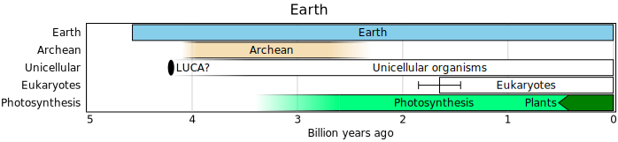
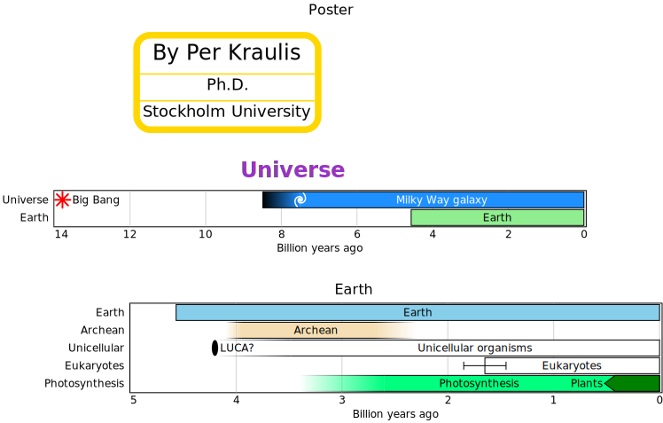

# timelines

- [Examples](#examples)
- [Specification](#specification)
  - [universe](#universe)
  - [earth](#earth)
  - [universe_earth](#universe_earth)
  - [poster](#poster)

## Examples

### universe


```yaml
chysl:
  version: 0.1.0
  software: Chysl (Python) 0.1.0
  timestamp: '2025-05-20T13:58:21+00:00'
chart: timelines
title:
  text: Universe
  bold: true
  color: blue
entries:
- entry: event
  label: Big Bang
  timeline: Universe
  color: red
  instant: -13787000000
  marker: star
- entry: period
  label: Milky Way galaxy
  timeline: Universe
  color: navy
  begin:
    value: -7500000000
    low: -8500000000
  end: 0
  fuzzy: gradient
- entry: period
  label: Earth
  color: lightgreen
  begin: -4567000000
  end: 0
- entry: event
  label: Block
  timeline: markers
  instant:
    value: -12000000000
    error: 600000000
  marker: block
  placement: left
- entry: event
  label: Circle
  timeline: markers
  color: cyan
  instant: -10000000000
  marker: circle
  placement: center
- entry: event
  label: Ellipse
  timeline: markers
  color: blue
  instant: -8000000000
  marker: ellipse
  placement: left
- entry: event
  label: Oval
  timeline: markers
  color: orange
  instant:
    value: -6200000000
    low: -6500000000
    high: -5500000000
  placement: left
- entry: event
  label: Pyramid
  timeline: markers
  color: gold
  instant: -4000000000
  marker: pyramid
  placement: center
- entry: event
  label: Triangle
  timeline: markers
  color: purple
  instant: -2000000000
  marker: triangle
axis:
  absolute: true
  caption: Billion years ago
```
### earth



```yaml
chysl:
  version: 0.1.0
  software: Chysl (Python) 0.1.0
  timestamp: '2025-05-20T13:58:21+00:00'
chart: timelines
title: Earth
entries:
- entry: period
  label: Earth
  begin: -4567000000
  end: 0
- entry: period
  label: Archean
  color: wheat
  begin:
    value: -4000000000
    low: -4100000000
    high: -3950000000
  end:
    value: -2500000000
    error: 200000000
  fuzzy: gradient
- entry: event
  label: LUCA?
  timeline: Unicellular
  instant: -4200000000
- entry: period
  label: Unicellular organisms
  timeline: Unicellular
  begin:
    value: -3480000000
    low: -4200000000
  end: 0
  fuzzy: gradient
- entry: period
  label: Eukaryotes
  begin: -1650000000
  end: 0
- entry: period
  label: Engineers
  color: lightgray
  begin:
    value: -3300000000
    error: 200000000
  end: -1650000000
  fuzzy: wedge
- entry: period
  label: Photosynthesis
  color: springgreen
  begin: -3400000000
  end: 0
- entry: period
  label: Plants
  timeline: Photosynthesis
  color: green
  begin: -470000000
  end: 0
  placement: left
axis:
  absolute: true
  caption: Billion years ago
```
### universe_earth


```yaml
chysl:
  version: 0.1.0
  software: Chysl (Python) 0.1.0
  timestamp: '2025-05-20T13:58:21+00:00'
chart: column
title: Universe and Earth
entries:
- chart: timelines
  title:
    text: Universe
    bold: true
    color: blue
  entries:
  - entry: event
    label: Big Bang
    timeline: Universe
    color: red
    instant: -13787000000
    marker: star
  - entry: period
    label: Milky Way galaxy
    timeline: Universe
    color: navy
    begin:
      value: -7500000000
      low: -8500000000
    end: 0
    fuzzy: gradient
  - entry: period
    label: Earth
    color: lightgreen
    begin: -4567000000
    end: 0
  - entry: event
    label: Block
    timeline: markers
    instant:
      value: -12000000000
      error: 600000000
    marker: block
    placement: left
  - entry: event
    label: Circle
    timeline: markers
    color: cyan
    instant: -10000000000
    marker: circle
    placement: center
  - entry: event
    label: Ellipse
    timeline: markers
    color: blue
    instant: -8000000000
    marker: ellipse
    placement: left
  - entry: event
    label: Oval
    timeline: markers
    color: orange
    instant:
      value: -6200000000
      low: -6500000000
      high: -5500000000
    placement: left
  - entry: event
    label: Pyramid
    timeline: markers
    color: gold
    instant: -4000000000
    marker: pyramid
    placement: center
  - entry: event
    label: Triangle
    timeline: markers
    color: purple
    instant: -2000000000
    marker: triangle
  legend: false
  axis:
    absolute: true
    caption: Billion years ago
- chart: timelines
  title: Earth
  entries:
  - entry: period
    label: Earth
    begin: -4567000000
    end: 0
  - entry: period
    label: Archean
    color: wheat
    begin:
      value: -4000000000
      low: -4100000000
      high: -3950000000
    end:
      value: -2500000000
      error: 200000000
    fuzzy: gradient
  - entry: event
    label: LUCA?
    timeline: Unicellular
    instant: -4200000000
  - entry: period
    label: Unicellular organisms
    timeline: Unicellular
    begin:
      value: -3480000000
      low: -4200000000
    end: 0
    fuzzy: gradient
  - entry: period
    label: Eukaryotes
    begin: -1650000000
    end: 0
  - entry: period
    label: Engineers
    color: lightgray
    begin:
      value: -3300000000
      error: 200000000
    end: -1650000000
    fuzzy: wedge
  - entry: period
    label: Photosynthesis
    color: springgreen
    begin: -3400000000
    end: 0
  - entry: period
    label: Plants
    timeline: Photosynthesis
    color: green
    begin: -470000000
    end: 0
    placement: left
  legend: false
  axis:
    absolute: true
    caption: Billion years ago
```
### poster



```yaml
chysl:
  version: 0.1.0
  software: Chysl (Python) 0.1.0
  timestamp: '2025-05-20T13:58:21+00:00'
chart: board
title: Poster
entries:
- x: 250
  y: 10
  scale: 1
  component:
    chart: note
    title: By Per Kraulis
    body: Ph.D.
    footer: Stockholm University
- x: 0
  y: 100
  scale: 1
  component:
    include: universe.yaml
- x: 50
  y: 230
  scale: 1
  component:
    include: earth.yaml
```
## Specification

[JSON Schema](timelines.md)

Timelines having events and periods.

- **chart**:
  - *required*
  - *const* 'timelines'
- **title**: Title of the timelines chart.
  - *See* [text](schema_defs.md#text).
- **width**: Width of chart, in pixels.
  - *type*: float
  - *exclusiveMinimum*: 0
  - *default*: 600
- **legend**: Display legend.
  - *type*: boolean
  - *default*: true
- **axis**: Time axis specification.
  - Alternative 1: Display default time axis.
    - *type*: boolean
    - *default*: true
  - Alternative 2: Time axis details.
    - *type*: mapping
    - **absolute**: Display absolute values for ticks.
      - *type*: boolean
      - *default*: false
    - **color**: Color of grid lines.
      - *type*: string
      - *format*: color
      - *default*: 'gray'
    - **caption**: Time axis description.
      - *type*: string
- **entries**: Entries in the timelines.
  - *required*
  - *type*: sequence
  - *items*:
    - Alternative 1: Event at an instant in time.
      - *type*: mapping
      - **entry**:
        - *required*
        - *const* 'event'
      - **label**: Description of the event.
        - *required*
        - *type*: string
      - **instant**: Time of the event.
        - *See* [fuzzy_number](schema_defs.md#fuzzy_number).
        - *required*
      - **timeline**: Timeline to place the event in.
        - *type*: string
      - **marker**: Marker for event.
        - *one of*: 'disc', 'circle', 'oval', 'ellipse', 'block', 'square', 'bar', 'pyramid', 'triangle', 'star', 'none'
        - *default*: 'oval'
      - **color**: Color of the event marker.
        - *type*: string
        - *format*: color
        - *default*: 'black'
      - **placement**: Placement of event label.
        - *one of*: 'left', 'center', 'right'
        - *default*: 'right'
      - **fuzzy**: Error bar marker for fuzzy number.
        - *type*: boolean
        - *default*: true
    - Alternative 2: Period of time.
      - *type*: mapping
      - **entry**:
        - *required*
        - *const* 'period'
      - **label**: Description of the period.
        - *required*
        - *type*: string
      - **begin**: Starting time of the period.
        - *See* [fuzzy_number](schema_defs.md#fuzzy_number).
        - *required*
      - **end**: Ending time of the period.
        - *See* [fuzzy_number](schema_defs.md#fuzzy_number).
        - *required*
      - **timeline**: Timeline to place the period in.
        - *type*: string
      - **color**: Color of the period graphic.
        - *type*: string
        - *format*: color
        - *default*: 'white'
      - **placement**: Placement of period label.
        - *one of*: 'left', 'center', 'right'
        - *default*: 'center'
      - **fuzzy**: Marker to use for fuzzy number.
        - *one of*: 'error', 'wedge', 'gradient', 'none'
        - *default*: 'error'

