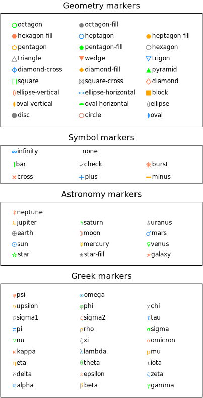

# timelines

- [Examples](#examples)
  - [universe](#universe)
  - [earth](#earth)
  - [universe_earth](#universe_earth)
  - [markers](#markers)
  - [poster](#poster)
  - [dimensions](#dimensions)

- [Specification](#specification)

## Examples

### universe


```yaml
chysl:
  version: 0.2.8
  software: Chysl (Python) 0.2.8
chart: timelines
title:
  text: Universe
  bold: true
  color: blue
entries:
- entry: event
  label: Big Bang
  timeline: Universe
  color: red
  instant: -13787000000
  marker: burst
- entry: period
  label: Milky Way galaxy
  timeline: Universe
  color: dodgerblue
  begin:
    value: -7500000000
    low: -8500000000
  end: 0
  fuzzy: gradient
- entry: event
  label: ''
  timeline: Universe
  color: navy
  instant: -8500000000
  marker: galaxy
- entry: period
  label: Earth
  color: lightgreen
  begin: -4567000000
  end: 0
axis:
  absolute: true
  caption: Billion years ago
```
### earth


```yaml
chysl:
  version: 0.2.8
  software: Chysl (Python) 0.2.8
chart: timelines
title: Earth
entries:
- entry: period
  label: Earth
  begin: -4567000000
  end: 0
- entry: period
  label: Archean
  color: wheat
  begin:
    value: -4000000000
    low: -4100000000
    high: -3950000000
  end:
    value: -2500000000
    error: 200000000
  fuzzy: gradient
- entry: event
  label: LUCA?
  timeline: Unicellular
  instant: -4200000000
- entry: period
  label: Unicellular organisms
  timeline: Unicellular
  begin:
    value: -3480000000
    low: -4200000000
  end: 0
  fuzzy: gradient
- entry: period
  label: Eukaryotes
  begin: -1650000000
  end: 0
- entry: period
  label: Engineers
  color: lightgray
  begin:
    value: -3300000000
    error: 200000000
  end: -1650000000
  fuzzy: wedge
- entry: period
  label: Photosynthesis
  color: springgreen
  begin: -3400000000
  end: 0
- entry: period
  label: Plants
  timeline: Photosynthesis
  color: green
  begin: -470000000
  end: 0
  placement: left
axis:
  absolute: true
  caption: Billion years ago
```
### universe_earth


```yaml
chysl:
  version: 0.2.8
  software: Chysl (Python) 0.2.8
chart: column
title: Universe and Earth
entries:
- chart: timelines
  title:
    text: Universe
    bold: true
    color: blue
  entries:
  - entry: event
    label: Big Bang
    timeline: Universe
    color: red
    instant: -13787000000
    marker: burst
  - entry: period
    label: Milky Way galaxy
    timeline: Universe
    color: dodgerblue
    begin:
      value: -7500000000
      low: -8500000000
    end: 0
    fuzzy: gradient
  - entry: event
    label: ''
    timeline: Universe
    color: navy
    instant: -8500000000
    marker: galaxy
  - entry: period
    label: Earth
    color: lightgreen
    begin: -4567000000
    end: 0
  legend: false
  axis:
    absolute: true
    caption: Billion years ago
- chart: timelines
  title: Earth
  entries:
  - entry: period
    label: Earth
    begin: -4567000000
    end: 0
  - entry: period
    label: Archean
    color: wheat
    begin:
      value: -4000000000
      low: -4100000000
      high: -3950000000
    end:
      value: -2500000000
      error: 200000000
    fuzzy: gradient
  - entry: event
    label: LUCA?
    timeline: Unicellular
    instant: -4200000000
  - entry: period
    label: Unicellular organisms
    timeline: Unicellular
    begin:
      value: -3480000000
      low: -4200000000
    end: 0
    fuzzy: gradient
  - entry: period
    label: Eukaryotes
    begin: -1650000000
    end: 0
  - entry: period
    label: Engineers
    color: lightgray
    begin:
      value: -3300000000
      error: 200000000
    end: -1650000000
    fuzzy: wedge
  - entry: period
    label: Photosynthesis
    color: springgreen
    begin: -3400000000
    end: 0
  - entry: period
    label: Plants
    timeline: Photosynthesis
    color: green
    begin: -470000000
    end: 0
    placement: left
  legend: false
  axis:
    absolute: true
    caption: Billion years ago
```
### markers



```yaml
chysl:
  version: 0.2.8
  software: Chysl (Python) 0.2.8
chart: column
title: Predefined markers
entries:
- chart: timelines
  title: Geometry markers
  entries:
  - entry: period
    label: Length
    begin: 0
    end: 3
  - entry: event
    label: disc
    timeline: Row 1
    color: gray
    instant: 0.25
    marker: disc
  - entry: event
    label: circle
    timeline: Row 1
    color: coral
    instant: 1.25
    marker: circle
  - entry: event
    label: oval
    timeline: Row 1
    color: dodgerblue
    instant: 2.25
  - entry: event
    label: oval-vertical
    timeline: Row 2
    color: orange
    instant: 0.25
    marker: oval-vertical
  - entry: event
    label: oval-horizontal
    timeline: Row 2
    color: lime
    instant: 1.25
    marker: oval-horizontal
  - entry: event
    label: ellipse
    timeline: Row 2
    color: gray
    instant: 2.25
    marker: ellipse
  - entry: event
    label: ellipse-vertical
    timeline: Row 3
    color: coral
    instant: 0.25
    marker: ellipse-vertical
  - entry: event
    label: ellipse-horizontal
    timeline: Row 3
    color: dodgerblue
    instant: 1.25
    marker: ellipse-horizontal
  - entry: event
    label: block
    timeline: Row 3
    color: orange
    instant: 2.25
    marker: block
  - entry: event
    label: square
    timeline: Row 4
    color: lime
    instant: 0.25
    marker: square
  - entry: event
    label: square-cross
    timeline: Row 4
    color: gray
    instant: 1.25
    marker: square-cross
  - entry: event
    label: diamond
    timeline: Row 4
    color: coral
    instant: 2.25
    marker: diamond
  - entry: event
    label: diamond-cross
    timeline: Row 5
    color: dodgerblue
    instant: 0.25
    marker: diamond-cross
  - entry: event
    label: diamond-fill
    timeline: Row 5
    color: orange
    instant: 1.25
    marker: diamond-fill
  - entry: event
    label: pyramid
    timeline: Row 5
    color: lime
    instant: 2.25
    marker: pyramid
  - entry: event
    label: triangle
    timeline: Row 6
    color: gray
    instant: 0.25
    marker: triangle
  - entry: event
    label: wedge
    timeline: Row 6
    color: coral
    instant: 1.25
    marker: wedge
  - entry: event
    label: trigon
    timeline: Row 6
    color: dodgerblue
    instant: 2.25
    marker: trigon
  - entry: event
    label: pentagon
    timeline: Row 7
    color: orange
    instant: 0.25
    marker: pentagon
  - entry: event
    label: pentagon-fill
    timeline: Row 7
    color: lime
    instant: 1.25
    marker: pentagon-fill
  - entry: event
    label: hexagon
    timeline: Row 7
    color: gray
    instant: 2.25
    marker: hexagon
  - entry: event
    label: hexagon-fill
    timeline: Row 8
    color: coral
    instant: 0.25
    marker: hexagon-fill
  - entry: event
    label: heptagon
    timeline: Row 8
    color: dodgerblue
    instant: 1.25
    marker: heptagon
  - entry: event
    label: heptagon-fill
    timeline: Row 8
    color: orange
    instant: 2.25
    marker: heptagon-fill
  - entry: event
    label: octagon
    timeline: Row 9
    color: lime
    instant: 0.25
    marker: octagon
  - entry: event
    label: octagon-fill
    timeline: Row 9
    color: gray
    instant: 1.25
    marker: octagon-fill
  legend: false
  axis: false
- chart: timelines
  title: Symbol markers
  entries:
  - entry: period
    label: Length
    begin: 0
    end: 3
  - entry: event
    label: cross
    timeline: Row 1
    color: coral
    instant: 0.25
    marker: cross
  - entry: event
    label: plus
    timeline: Row 1
    color: dodgerblue
    instant: 1.25
    marker: plus
  - entry: event
    label: minus
    timeline: Row 1
    color: orange
    instant: 2.25
    marker: minus
  - entry: event
    label: bar
    timeline: Row 2
    color: lime
    instant: 0.25
    marker: bar
  - entry: event
    label: check
    timeline: Row 2
    color: gray
    instant: 1.25
    marker: check
  - entry: event
    label: burst
    timeline: Row 2
    color: coral
    instant: 2.25
    marker: burst
  - entry: event
    label: infinity
    timeline: Row 3
    color: dodgerblue
    instant: 0.25
    marker: infinity
  - entry: event
    label: none
    timeline: Row 3
    color: orange
    instant: 1.25
    marker: none
  legend: false
  axis: false
- chart: timelines
  title: Astronomy markers
  entries:
  - entry: period
    label: Length
    begin: 0
    end: 3
  - entry: event
    label: star
    timeline: Row 1
    color: lime
    instant: 0.25
    marker: star
  - entry: event
    label: star-fill
    timeline: Row 1
    color: gray
    instant: 1.25
    marker: star-fill
  - entry: event
    label: galaxy
    timeline: Row 1
    color: coral
    instant: 2.25
    marker: galaxy
  - entry: event
    label: sun
    timeline: Row 2
    color: dodgerblue
    instant: 0.25
    marker: sun
  - entry: event
    label: mercury
    timeline: Row 2
    color: orange
    instant: 1.25
    marker: mercury
  - entry: event
    label: venus
    timeline: Row 2
    color: lime
    instant: 2.25
    marker: venus
  - entry: event
    label: earth
    timeline: Row 3
    color: gray
    instant: 0.25
    marker: earth
  - entry: event
    label: moon
    timeline: Row 3
    color: coral
    instant: 1.25
    marker: moon
  - entry: event
    label: mars
    timeline: Row 3
    color: dodgerblue
    instant: 2.25
    marker: mars
  - entry: event
    label: jupiter
    timeline: Row 4
    color: orange
    instant: 0.25
    marker: jupiter
  - entry: event
    label: saturn
    timeline: Row 4
    color: lime
    instant: 1.25
    marker: saturn
  - entry: event
    label: uranus
    timeline: Row 4
    color: gray
    instant: 2.25
    marker: uranus
  - entry: event
    label: neptune
    timeline: Row 5
    color: coral
    instant: 0.25
    marker: neptune
  legend: false
  axis: false
- chart: timelines
  title: Greek markers
  entries:
  - entry: period
    label: Length
    begin: 0
    end: 3
  - entry: event
    label: alpha
    timeline: Row 1
    color: dodgerblue
    instant: 0.25
    marker: alpha
  - entry: event
    label: beta
    timeline: Row 1
    color: orange
    instant: 1.25
    marker: beta
  - entry: event
    label: gamma
    timeline: Row 1
    color: lime
    instant: 2.25
    marker: gamma
  - entry: event
    label: delta
    timeline: Row 2
    color: gray
    instant: 0.25
    marker: delta
  - entry: event
    label: epsilon
    timeline: Row 2
    color: coral
    instant: 1.25
    marker: epsilon
  - entry: event
    label: zeta
    timeline: Row 2
    color: dodgerblue
    instant: 2.25
    marker: zeta
  - entry: event
    label: eta
    timeline: Row 3
    color: orange
    instant: 0.25
    marker: eta
  - entry: event
    label: theta
    timeline: Row 3
    color: lime
    instant: 1.25
    marker: theta
  - entry: event
    label: iota
    timeline: Row 3
    color: gray
    instant: 2.25
    marker: iota
  - entry: event
    label: kappa
    timeline: Row 4
    color: coral
    instant: 0.25
    marker: kappa
  - entry: event
    label: lambda
    timeline: Row 4
    color: dodgerblue
    instant: 1.25
    marker: lambda
  - entry: event
    label: mu
    timeline: Row 4
    color: orange
    instant: 2.25
    marker: mu
  - entry: event
    label: nu
    timeline: Row 5
    color: lime
    instant: 0.25
    marker: nu
  - entry: event
    label: xi
    timeline: Row 5
    color: gray
    instant: 1.25
    marker: xi
  - entry: event
    label: omicron
    timeline: Row 5
    color: coral
    instant: 2.25
    marker: omicron
  - entry: event
    label: pi
    timeline: Row 6
    color: dodgerblue
    instant: 0.25
    marker: pi
  - entry: event
    label: rho
    timeline: Row 6
    color: orange
    instant: 1.25
    marker: rho
  - entry: event
    label: sigma
    timeline: Row 6
    color: lime
    instant: 2.25
    marker: sigma
  - entry: event
    label: sigma1
    timeline: Row 7
    color: gray
    instant: 0.25
    marker: sigma1
  - entry: event
    label: sigma2
    timeline: Row 7
    color: coral
    instant: 1.25
    marker: sigma2
  - entry: event
    label: tau
    timeline: Row 7
    color: dodgerblue
    instant: 2.25
    marker: tau
  - entry: event
    label: upsilon
    timeline: Row 8
    color: orange
    instant: 0.25
    marker: upsilon
  - entry: event
    label: phi
    timeline: Row 8
    color: lime
    instant: 1.25
    marker: phi
  - entry: event
    label: chi
    timeline: Row 8
    color: gray
    instant: 2.25
    marker: chi
  - entry: event
    label: psi
    timeline: Row 9
    color: coral
    instant: 0.25
    marker: psi
  - entry: event
    label: omega
    timeline: Row 9
    color: dodgerblue
    instant: 1.25
    marker: omega
  legend: false
  axis: false
```
### poster


```yaml
chysl:
  version: 0.2.8
  software: Chysl (Python) 0.2.8
chart: board
title: Poster
entries:
- x: 250
  y: 10
  scale: 1
  component:
    chart: note
    title: By Per Kraulis
    body: Ph.D.
    footer: Stockholm University
- x: 0
  y: 100
  scale: 1
  component:
    include: universe.yaml
- x: 50
  y: 230
  scale: 1
  component:
    include: earth.yaml
```
### dimensions


```yaml
chysl:
  version: 0.2.8
  software: Chysl (Python) 0.2.8
chart: column
title: Dimension tick ranges
entries:
- chart: timelines
  title: 1 - 1.00001
  entries:
  - entry: period
    label: Period
    begin: 1
    end: 1.00001
- chart: timelines
  title: 1 - 1.0001
  entries:
  - entry: period
    label: Period
    begin: 1
    end: 1.0001
- chart: timelines
  title: 1 - 1.0002
  entries:
  - entry: period
    label: Period
    begin: 1
    end: 1.0002
- chart: timelines
  title: 1 - 1.1
  entries:
  - entry: period
    label: Period
    begin: 1
    end: 1.1
- chart: timelines
  title: 1 - 2
  entries:
  - entry: period
    label: Period
    begin: 1
    end: 2
- chart: timelines
  title: 1 - 5
  entries:
  - entry: period
    label: Period
    begin: 1
    end: 5
- chart: timelines
  title: 1 - 10
  entries:
  - entry: period
    label: Period
    begin: 1
    end: 10
- chart: timelines
  title: 1 - 2000
  entries:
  - entry: period
    label: Period
    begin: 1
    end: 2000
- chart: timelines
  title: 1 - 10000000
  entries:
  - entry: period
    label: Period
    begin: 1
    end: 10000000
- chart: timelines
  title: 1 - 10000000000
  entries:
  - entry: period
    label: Period
    begin: 1
    end: 10000000000
```
## Specification

[JSON Schema](timelines.md)

Timelines having events and periods.

- **chart**:
  - *required*
  - *const* 'timelines'
- **title**: Title of the timelines chart.
  - *See* [text](schema_defs.md#text).
- **width**: Width of the chart, including legends etc.
  - *type*: float
  - *exclusiveMinimum*: 0
  - *default*: 600
- **legend**: Display legend.
  - *type*: boolean
  - *default*: true
- **axis**: Time axis specification.
  - *See* [axis](schema_defs.md#axis).
- **entries**: Entries in the timelines.
  - *required*
  - *type*: sequence
  - *items*:
    - Alternative 1: Event at an instant in time.
      - *type*: mapping
      - **entry**:
        - *required*
        - *const* 'event'
      - **label**: Description of the event.
        - *required*
        - *type*: string
      - **instant**: Time of the event.
        - *See* [fuzzy_number](schema_defs.md#fuzzy_number).
        - *required*
      - **timeline**: Timeline to place the event in.
        - *type*: string
      - **marker**: Marker for event.
        - *See* [marker](schema_defs.md#marker).
      - **color**: Color of the event marker.
        - *type*: string
        - *format*: color
        - *default*: 'black'
      - **placement**: Placement of event label.
        - *one of*: 'left', 'center', 'right'
        - *default*: 'right'
      - **fuzzy**: Error bar marker for fuzzy number.
        - *type*: boolean
        - *default*: true
    - Alternative 2: Period of time.
      - *type*: mapping
      - **entry**:
        - *required*
        - *const* 'period'
      - **label**: Description of the period.
        - *required*
        - *type*: string
      - **begin**: Starting time of the period.
        - *See* [fuzzy_number](schema_defs.md#fuzzy_number).
        - *required*
      - **end**: Ending time of the period.
        - *See* [fuzzy_number](schema_defs.md#fuzzy_number).
        - *required*
      - **timeline**: Timeline to place the period in.
        - *type*: string
      - **color**: Color of the period graphic.
        - *type*: string
        - *format*: color
        - *default*: 'white'
      - **placement**: Placement of period label.
        - *one of*: 'left', 'center', 'right'
        - *default*: 'center'
      - **fuzzy**: Marker to use for fuzzy number.
        - *one of*: 'error', 'wedge', 'gradient', 'none'
        - *default*: 'error'

